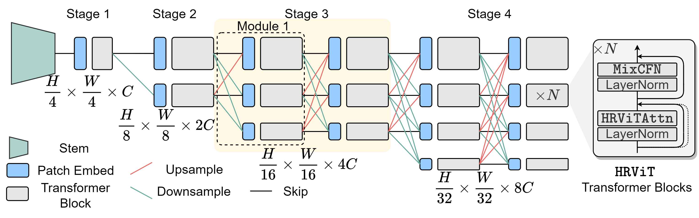
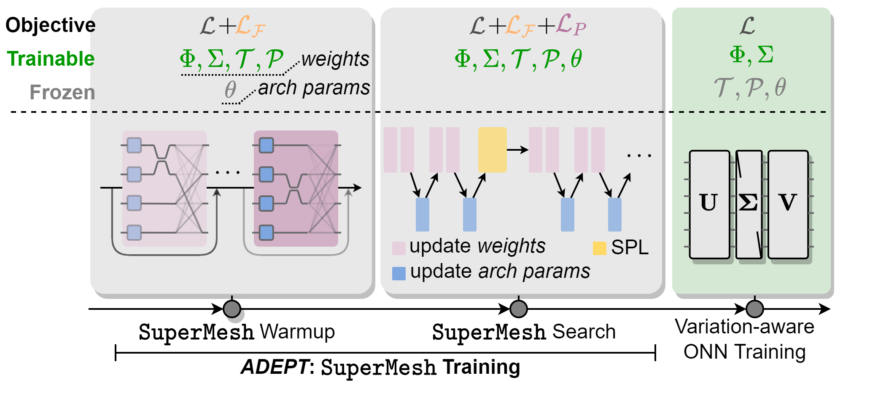
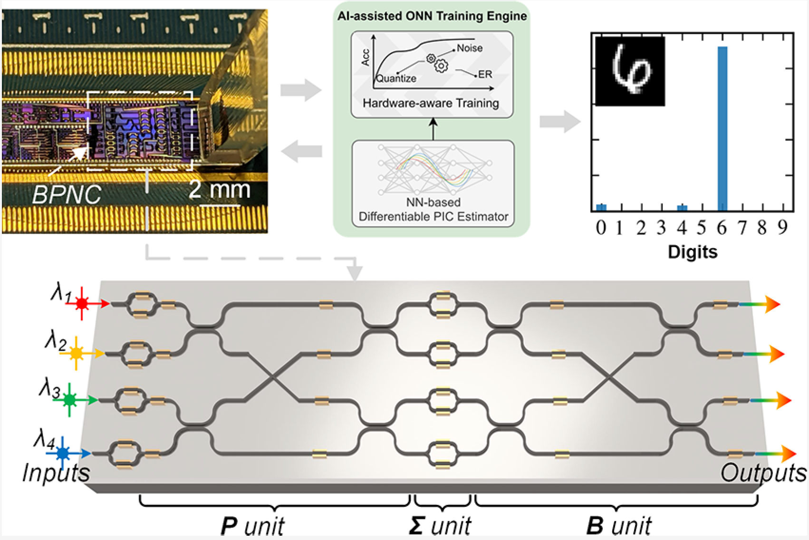
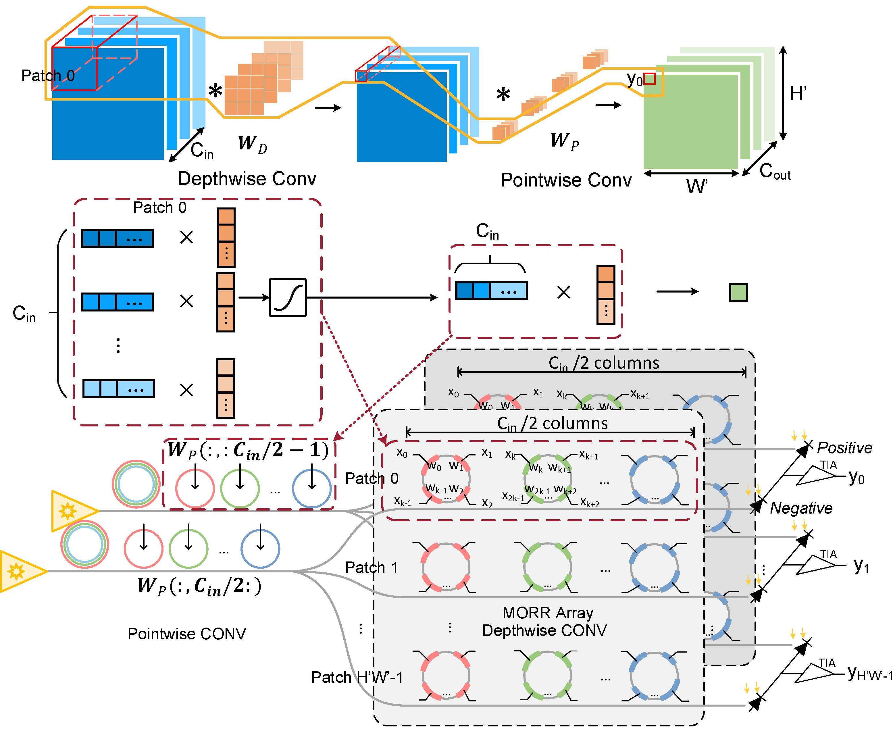



  

You can also find my articles on <a href="{{author.googlescholar}}">my Google Scholar profile</a> and <a href="{{author.researchgate}}">my ResearchGate profile</a>.
{: .notice--info}

Preprint
======
* 2023
  ### P2. Light-AI Interaction: Bridging Photonics and Artificial Intelligence via Cross-Layer Hardware/Software Co-Design
   * <a href="/publications/papers/Dissertation_JiaqiGu_final.pdf" style="color:#3793ae">preprint</a>
   * **Jiaqi Gu**
   * Ph.D. Dissertation, May 2023.  

* 2021
  ### P1. [Light in Artificial Intelligence: Efficient Neurocomputing with Optical Neural Networks](https://src.acm.org/binaries/content/assets/src/2021/jiaqi-gu.pdf)
   * <a href="/publications/papers/ONN_ACMSRC2021_Gu.pdf" style="color:#3793ae">preprint</a>
   * **Jiaqi Gu** and David Z.Pan
   * ACM Student Research Competition Grand Finals, 2021. (First Place in Graduate Category)  

Conference Papers
======
* 2024
  ### C58. [Q-Pilot: Field Programmable Quantum Array Compilation with Flying Ancillas](https://arxiv.org/pdf/2311.16190)
    * [preprint](https://arxiv.org/pdf/2311.16190) | Accepted
    * Hanrui Wang, Bochen Tan, Pengyu Liu, Yilian Liu, **Jiaqi Gu**, Jason Cong and Song Han 
    * ACM/IEEE Design Automation Conference (DAC), San Francisco, CA, Jun 23 - Jun 27, 2024.
  
  ### C57. Foundry Manufactured 6-bit Resolution, 150um Long SlowLight Electro-Optic Modulator for On-Chip Photonic Tensor Computing
    * <a href="/publications/papers/ONN_CLEO2024_Gu.pdf" style="color:#3793ae">preprint</a> | Accepted
    * Meng Zhang, Amir Begović, Dennis Yin, Nicholas Gangi, **Jiaqi Gu** and Rena Huang 
    * Conference on Lasers and Electro-Optics (CLEO), Charlotte, NC, May 05-10, 2024.

  ### C56. [Lightening-Transformer: A Dynamically-operated Optically-interconnected Photonic Transformer Accelerator](https://arxiv.org/abs/2305.19533)
   * Accepted
   * Hanqing Zhu, **Jiaqi Gu**, Hanrui Wang, Rongxing Tang, Zhekai Zhang, Chenghao Feng, Song Han, Ray T. Chen and David Z. Pan
   * IEEE International Symposium on High-Performance Computer Architecture (HPCA), Edinburgh, Scotland, UK, Mar 2 - Mar 6, 2024.  

* 2023
  ### C55. [Pre-RMSNorm and Pre-CRMSNorm Transformers: Equivalent and Efficient Pre-LN Transformers](https://arxiv.org/abs/2305.14858)
    * [preprint](https://arxiv.org/abs/2305.14858) \| [code](https://github.com/ZixuanJiang/pre-rmsnorm-transformer)
    * Zixuan Jiang, **Jiaqi Gu**, Hanqing Zhu and David Z. Pan 
    * Conference on Neural Information Processing Systems (NeurIPS), New Orleans, Louisiana, Dec 10 - Dec 16, 2023. (**Spotlight**).
  
  ### C54. [Deep Learning for Neutron Lifetime Measurement](https://meetings.aps.org/Meeting/HAW23/Session/D06.8)
    * Shanny Lin, Steven Clayton, Chenghao Feng, **Jiaqi Gu**, Christopher Morris, Maninder Singh, Hanqing Zhu, David Z. Pan, Ray T. Chen and Zhehui Wang 
    * 6th Joint Meeting of the APS Division of Nuclear Physics and the Physical Society of Japan, Hawaii, the Big Island, Nov 26 – Dec 1, 2023.
  
  ### C53. [DGR: Tackling Drifted and Correlated Noise in Quantum Error Correction via Decoding Graph Re-weighting](https://arxiv.org/pdf/2311.16214)
    * [preprint](https://arxiv.org/pdf/2311.16214)
    * Hanrui Wang, Pengyu Liu, Yilian Liu, **Jiaqi Gu**, Jonathan Baker, Frederic T Chong and Song Han 
    * arXiv preprint arXiv:2311.16214.

  ### C52. [Robuststate: Boosting fidelity of quantum state preparation via noise-aware variational training](https://arxiv.org/pdf/2311.16035)
    * [preprint](https://arxiv.org/pdf/2311.16035)
    * Hanrui Wang, Yilian Liu, Pengyu Liu, **Jiaqi Gu**, Zirui Li, Zhiding Liang, Jinglei Cheng, Yongshan Ding, Xuehai Qian, Yiyu Shi, David Z Pan, Frederic T Chong and Song Han 
    * arXiv preprint arXiv:2311.16035.

  ### C51. [Transformer-QEC: Quantum Error Correction Code Decoding with Transferable Transformers](https://arxiv.org/pdf/2311.16082)
    * [preprint](https://arxiv.org/pdf/2311.16082)
    * Hanrui Wang, Pengyu Liu, Kevin Shao, Dantong Li, **Jiaqi Gu**, David Z Pan, Yongshan Ding, Song Han 
    * arXiv preprint arXiv:2311.16082.

  ### C50. [FPQA-C: A Compilation Framework for Field Programmable Qubit Array](https://arxiv.org/pdf/2311.15123)
    * [preprint](https://arxiv.org/pdf/2311.15123)
    * Hanrui Wang, Pengyu Liu, Bochen Tan, Yilian Liu, **Jiaqi Gu**, David Z Pan, Jason Cong, Umut Acar and Song Han 
    * arXiv preprint arXiv:2311.15123.

  ### C49. [Benchmarking the Robustness of Neural Network-based Partial Differential Equation Solvers](https://fastmachinelearning.org/iccad2023/file/fastml-iccad-23-final5.pdf)
    * **Jiaqi Gu**, Mohit Dighamber, Zhengqi Gao and Duane S Boning 
    * IEEE/ACM International Conference on Computer-Aided Design (ICCAD), Fast Machine Learning for Science Workshop, Nov 2, 2023.

  ### C48. [QuantumSEA: In-Time Sparse Exploration for Noise Adaptive Quantum Circuits](https://ieeexplore.ieee.org/document/10313775)
    * <a href="/publications/papers/Quant_QCE2023_Gu.pdf" style="color:#3793ae">preprint</a>
    * Tianlong Chen, Zhenyu Zhang, Hanrui Wang, **Jiaqi Gu**, Zirui Li, David Z. Pan, Frederic Chong, Song Han and Zhangyang Wang
    * International Conference on Quantum Computing and Engineering (QCE), Sep 17 - Sep 22 2023.

  ### C47. [Integrated Photonics for Computing and Artificial Intelligence](https://doi.org/10.1109/SUM57928.2023.10224461)
    * <a href="/publications/papers/ONN_IEEESUM2023_Gu.pdf" style="color:#3793ae">preprint</a>
    * Chenghao Feng, Shupeng Ning, **Jiaqi Gu**, Hanqing Zhu, David Z. Pan and Ray T. Chen
    * IEEE Photonics Society Summer Topicals Meeting Series (SUM), Sicily, Italy, Jul 17 - Jul 19, 2023.

  ### C46. [NormSoftmax: Normalizing the Input of Softmax to Accelerate and Stabilize Training](https://openreview.net/pdf?id=4g7nCbpjNwd)	
   * Accepted
   * Zixuan Jiang, **Jiaqi Gu** and David Pan
   * IEEE International Conference on Omni Layer Intelligent Systems (COINS), Jul 23 - Jul 25, 2023.   
  
  ### C45. [Delving into Effective Gradient Matching for Dataset Condensation](https://arxiv.org/abs/2208.00311)
   * Accepted
   * Zixuan Jiang, **Jiaqi Gu**, Mingjie Liu and David Pan
   * 2023 IEEE International Conference on Omni Layer Intelligent Systems (COINS), Jul 23 - Jul 25, 2023.  

  ### C44. [DOTA: A Dynamically-Operated Photonic Tensor Core for Energy-Efficient Transformer Accelerator](https://arxiv.org/abs/2305.19533)
   * preprint
   * Hanqing Zhu, **Jiaqi Gu**, Hanrui Wang, Rongxing Tang, Zhekai Zhang, Chenghao Feng, Song Han, Ray T. Chen and David Z. Pan
   * Conference on Machine Learning and Systems (MLSys) Systems for Next-Gen AI Paradigms (SNAP) Workshop, Miami, OL, Jun 4 - Jun 8, 2023.  

  ### C43. [Light-AI Interaction: Bridging Photonics and AI with Cross-Layer Hardware-Software Co-Design]
   * <a href="/publications/papers/ONN_MLSys_SNAP2023_Gu.pdf" style="color:#3793ae">preprint</a> <a href="/publications/papers/ONN_MLSys_SNAP2023_Gu_slides.pdf" style="color:#3793ae">| slides</a>
   * **Jiaqi Gu**, Chenghao Feng, Hanqing Zhu, Ray T. Chen and David Z. Pan
   * Conference on Machine Learning and Systems (MLSys) Systems for Next-Gen AI Paradigms (SNAP) Workshop, Miami, OL, Jun 4 - Jun 8, 2023.  

  ### C42. [Evaluation of a compact butterfly-style photonic-electronic neural chip on complicated deep learning tasks](https://doi.org/10.1364/CLEO_SI.2023.SM2P.6)
    * <a href="/publications/papers/ONN_CLEO2023_Gu.pdf" style="color:#3793ae">preprint</a>
    * Chenghao Feng, **Jiaqi Gu**, Hanqing Zhu, Rongxing Tang, David Z. Pan, and Ray T. Chen
    * Conference on Lasers and Electro-Optics (CLEO), San Jose, CA, May. 07-12, 2023. 

  ### C41. [Light-AI Interaction: The Convergence of Photonic AI and Cross-layer Circuit-Architecture-Algorithm Co-design](https://spie.org/photonics-west/presentation/Light-AI-interaction--the-convergence-of-photonic-AI-and/12427-2?SSO=1)
   * *Invited Paper*
   * **Jiaqi Gu**, Chenghao Feng, Hanqing Zhu, Ray T. Chen and David Z. Pan
   * SPIE Photonics West (OPTO), San Francisco, CA, Jan 28 - Feb 2, 2023.  
  
  ### C40. [Optically-Interconnected, Hardware-Efficient, Electronic-Photonic Neural Network using Compact Multi-Operand Photonic Devices](https://spie.org/photonics-west/presentation/Optically-interconnected-hardware-efficient-electronic-photonic-neural-network-using-compact/12427-3)
   * accepted
   * Chenghao Feng, Rongxing Tang, **Jiaqi Gu**, Hanqing Zhu, David Z. Pan, and Ray T. Chen
   * SPIE Photonics West (OPTO), San Francisco, CA, Jan 28 - Feb 2, 2023.  

* 2022
  ### C39. [NeurOLight: A Physics-Agnostic Neural Operator Enabling Parametric Photonic Device Simulation](http://arxiv.org/abs/2209.10098)
   * preprint
   * **Jiaqi Gu**, Zhengqi Gao, Chenghao Feng, Hanqing Zhu, Ray T. Chen, Duane S Boning and David Z. Pan
   * Conference on Neural Information Processing Systems (NeurIPS), New Orleans, Louisiana, Nov 26 - Dec 4, 2022. (**Spotlight**) 

  ### C38. [HEAT: Hardware-Efficient Automatic Tensor Decomposition for Transformer Compression](https://arxiv.org/abs/2211.16749)
   * preprint
   * **Jiaqi Gu**, Ben Keller, Jean Kossaifi, Anima Anandkumar, Brucek Khailany, David Z. Pan
   * Conference on Neural Information Processing Systems (NeurIPS), ML for System Workshop, New Orleans, Louisiana, Nov 26 - Dec 4, 2022. (**Spotlight**) 

  ### C37. [RobustAnalog: Fast Variation-Aware Analog Circuit Design Via Multi-task RL](https://arxiv.org/abs/2207.06412)
   * preprint
   * Wei Shi, Hanrui Wang, **Jiaqi Gu**, Mingjie Liu, David Pan, Song Han and Nan Sun
   * ACM/IEEE Workshop on Machine Learning for CAD (MLCAD), Snowbird, Utah, Sept 12 - 13, 2022. 

  ### C36. [Fuse and Mix: MACAM-Enabled Analog Activation for Energy-Efficient Neural Acceleration](https://arxiv.org/abs/2208.08099)
   * preprint
   * Hanqing Zhu, Keren Zhu, **Jiaqi Gu**, Harrison Jin, Ray T. Chen, Jean Anne Incorvia and David Z. Pan
   * IEEE/ACM International Conference on Computer-Aided Design (ICCAD), Oct 30 - Nov 03, 2022.  
  
  ### C35. [TorchQuantum Case Study for Robust Quantum Circuits](https://qmlsys.mit.edu/wp-content/uploads/2022/09/ICCAD2022_Transformer.pdf)
   * *Invited Paper*
   * HHanrui Wang, Zhiding Liang, **Jiaqi Gu**, Zirui Li, Yongshan Ding, Weiwen Jiang, Yiyu Shi, David Z. Pan, Frederic T. Chong and Song Han
   * IEEE/ACM International Conference on Computer-Aided Design (ICCAD), Oct 30 - Nov 03, 2022.  

  ### C34. [Optoelectronically Interconnected Hardware-Efficient Deep Learning using Silicon Photonic Chips](https://doi.org/10.1117/12.2616217)
   * preprint
   * Chenghao Feng, **Jiaqi Gu**, Hanqing Zhu, Zhoufeng Ying, Zheng Zhao, David Z. Pan, and Ray T. Chen
   * SPIE PC12007, Optical Interconnects XXII, San Francisco, CA, Mar 5, 2022.  

  ### C33. [Design and Experimental Demonstration of A Hardware-Efficient Integrated Optical Neural Network](https://doi.org/10.1117/12.2610255)
   * preprint
   * Chenghao Feng, **Jiaqi Gu**, Hanqing Zhu, David Z. Pan, and Ray T. Chen
   * SPIE PC12005, Smart Photonic and Optoelectronic Integrated Circuits, San Francisco, CA, Mar 5, 2022.  

  ### C32. [Multi-Scale High-Resolution Vision Transformer for Semantic Segmentation](https://arxiv.org/abs/2111.01236)
   * <a href="/publications/papers/ML_CVPR2022_Gu_poster.pdf" style="color:#3793ae">poster</a> \| <a href="/publications/papers/ML_CVPR2022_Gu_slides.pdf" style="color:#3793ae">slides</a> \| [code](https://github.com/facebookresearch/HRViT)
   * **Jiaqi Gu**, Hyoukjun Kwon, Dilin Wang, Wei Ye, Meng Li, Yu-Hsin Chen, Liangzhen Lai, Vikas Chandra, and David  Z. Pan
   * IEEE/CVF Conference on Computer Vision and Pattern Recognition (CVPR), New Orleans, Louisiana, June 21-24, 2022.  
   

  ### C31. [ADEPT: Automatic Differentiable DEsign of Photonic Tensor Cores](https://arxiv.org/abs/2112.08703)
   * <a href="/publications/papers/ONN_DAC2022_Gu.pdf" style="color:#3793ae">preprint</a> \| <a href="/publications/papers/ONN_DAC2022_Gu_slides.pdf" style="color:#3793ae">slides</a> \| [code](https://github.com/JeremieMelo/ADEPT)
   * **Jiaqi Gu**, Hanqing Zhu, Chenghao Feng, Zixuan Jiang, Mingjie Liu, Shuhan Zhang, Ray T. Chen, and David  Z. Pan
   * ACM/IEEE Design Automation Conference (DAC), San Francisco, CA, Jul 10-14, 2022. (**Best-in-Track Paper**)  
   

  ### C30. [QOC: Quantum On-Chip Training with Parameter Shift and Gradient Pruning](https://arxiv.org/abs/2202.13239)
   * <a href="/publications/papers/Quant_DAC2022_QOC_Gu.pdf" style="color:#3793ae">preprint</a> \| [code](https://github.com/mit-han-lab/pytorch-quantum)
   * Hanrui Wang, Zirui Li, **Jiaqi Gu**, Yongshan Ding, David Z. Pan, and Song Han
   * ACM/IEEE Design Automation Conference (DAC), San Francisco, CA, Jul 10-14, 2022.  

  ### C29. [QuantumNAT: Quantum Noise-Aware Training with Noise Injection, Quantization and Normalization](https://arxiv.org/abs/2110.11331)
   * <a href="/publications/papers/Quant_DAC2022_QuantumNAT_Gu.pdf" style="color:#3793ae">preprint</a> \| [code](https://github.com/mit-han-lab/pytorch-quantum)
   * Hanrui Wang, **Jiaqi Gu**, Yongshan Ding, Zirui Li, Frederic T. Chong, David Z. Pan, and Song Han
   * ACM/IEEE Design Automation Conference (DAC), San Francisco, CA, Jul 10-14, 2022.  

  ### C28. [A Timing Engine Inspired Graph Neural Network Model for Pre-Routing Slack Prediction]()
   * accepted \| <a href="/publications/papers/PD_DAC2022_Gu.pdf" style="color:#3793ae">preprint</a>
   * Zizheng Guo, Mingjie Liu, **Jiaqi Gu**, Shuhan Zhang, David Z. Pan, and Yibo Lin
   * ACM/IEEE Design Automation Conference (DAC), San Francisco, CA, Jul 10-14, 2022. (**Best-in-Track Paper**)  

  ### C27. [QuantumNAS: Noise-Adaptive Search for Robust Quantum Circuits](https://arxiv.org/abs/2107.10845)
   * <a href="/publications/papers/Quant_HPCA2022_Gu.pdf" style="color:#3793ae">preprint</a> \| <a href="/publications/papers/Quant_GTC2022_Gu_poster.pdf" style="color:#3793ae">poster</a> \| [code](https://github.com/mit-han-lab/pytorch-quantum)
   * Hanrui Wang, Yongshan Ding, **Jiaqi Gu**, Yujun Lin, David Z. Pan, Frederic T. Chong, and Song Han
   * IEEE International Symposium on High-Performance Computer Architecture (HPCA), Feb. 12–16, 2022.  
   

  ### C26. [ELight: Enabling Efficient Photonic In-Memory Neurocomputing with Life Enhancement](https://arxiv.org/abs/2112.08512)
   * <a href="/publications/papers/ONN_ASPDAC2022_Gu.pdf" style="color:#3793ae">preprint</a> \| [code](https://github.com/zhuhanqing/ELight)
   * Hanqing Zhu, **Jiaqi Gu**, Chenghao Feng, Mingjie Liu, Zixuan Jiang, Ray T. Chen, and David  Z. Pan
   * ACM/IEEE Asian and South Pacific Design Automation Conference (ASP-DAC), Jan. 17-20, 2022.  

* 2021
  ### C25. [L2ight: Enabling On-Chip Learning for Optical Neural Networks via Efficient in-situ Subspace Optimization](https://arxiv.org/abs/2110.14807)
   * <a href="/publications/papers/ONN_NeurIPS2021_Gu.pdf" style="color:#3793ae">preprint</a> \| <a href="/publications/papers/ONN_NeurIPS2021_Gu_poster.pdf" style="color:#3793ae">poster</a> \| <a href="/publications/papers/ONN_NeurIPS2021_Gu_slides.pdf" style="color:#3793ae">slides</a> \| [code](https://github.com/JeremieMelo/L2ight)
   * **Jiaqi Gu**, Hanqing Zhu, Chenghao Feng, Zixuan Jiang, Ray T. Chen, and David  Z. Pan
   * Conference on Neural Information Processing Systems (NeurIPS), Dec. 7-10, 2021.  
   

  ### C24. [Towards Memory-Efficient Neural Networks via Multi-Level in situ Generation](https://arxiv.org/abs/2108.11430)
   * <a href="/publications/papers/ML_ICCV2021_Gu.pdf" style="color:#3793ae">preprint</a> \| <a href="/publications/papers/ML_ICCV2021_Gu_poster.pdf" style="color:#3793ae">poster</a> \| <a href="/publications/papers/ML_ICCV2021_Gu_poster.pdf" style="color:#3793ae">slides</a> \| [code](https://github.com/JeremieMelo/Memory-Efficient-Multi-Level-Generation)
   * **Jiaqi Gu**, Hanqing Zhu, Chenghao Feng, Mingjie Liu, Zixuan Jiang, Ray T. Chen, and David  Z. Pan
   * International Conference on Computer Vision (ICCV), Oct. 10-17, 2021.  
   

  ### C23. [A New Acceleration Paradigm for Discrete Cosine Transform and Other Fourier-Related Transforms](https://arxiv.org/abs/2110.01172)
   * preprint \| [code](https://github.com/JeremieMelo/dct_cuda)
   * Zixuan Jiang, **Jiaqi Gu**, David Z. Pan
   * arXiv preprint 2110.01172.  

  ### C22. [Optimizer Fusion: Efficient Training with Better Locality and Parallelism](https://arxiv.org/abs/2104.00237)
   * <a href="/publications/papers/ML_ICLRW2021_Gu.pdf" style="color:#3793ae">preprint</a>
   * Zixuan Jiang, **Jiaqi Gu**, Mingjie Liu, Keren Zhu, and David  Z. Pan
   * International Conference on Learning Representations (ICLR) Workshop, Hardware Aware Efficient Training (HAET), May. 07, 2021.  
   

  ### C21. [Experimental Demonstration of a WDM-based Integrated Optical Decoder for Compact Optical Computing](https://doi.org/10.1364/CLEO_SI.2021.SW3C.3)
   * <a href="/publications/papers/ONN_CLEO2021_Gu.pdf" style="color:#3793ae">preprint</a>
   * Chenghao Feng, **Jiaqi Gu**, Hanqing Zhu, David  Z. Pan, and Ray T. Chen
   * Conference on Lasers and Electro-Optics (CLEO), Virtual Conference, May. 11-13, 2021.  

  ### C20. [Integrated Photonics for Computing, Interconnects and Sensing](https://www.youtube.com/watch?v=HqR3YVC2CUI)
   * *Invited Paper* \| <a href="/publications/papers/ONN_CLEO2021_Gu_Invited.pdf" style="color:#3793ae">preprint</a>
   * Jason Midkiff, Ali Rostamian, Kyoung Min Yoo, Aref Asghari, Chao Wang, Chenghao Feng, Zhoufeng Ying, **Jiaqi Gu**, Haixia Mei, Ching-Wen Chang, James Fang, Alan Huang, Jong-Dug Shin, Xiaochuan Xu, Michael Bukshtab, David  Z. Pan, and Ray T. Chen
   * Conference on Lasers and Electro-Optics (CLEO), Virtual Conference, May. 11-13, 2021.  
   

  ### C19. [Efficient On-Chip Learning for Optical Neural Networks Through Power-Aware Sparse Zeroth-Order Optimization](https://arxiv.org/abs/2012.11148)
   * <a href="/publications/papers/ONN_AAAI2021_Gu.pdf" style="color:#3793ae">preprint</a>
   * **Jiaqi Gu**, Chenghao Feng, Zheng Zhao, Zhoufeng Ying, Ray T. Chen and David Z. Pan
   * Association for the Advancement of Artificial Intelligence (AAAI), Virtual Conference, Feb. 02-09, 2021.  
   

  ### C18. [Logic Synthesis Meets Machine Learning: Trading Exactness for Generalization](https://arxiv.org/pdf/2012.02530)
   * <a href="/publications/papers/IWLS_DATE2021_Gu.pdf" style="color:#3793ae">preprint</a>
   * Shubham Rai, Walter Lau Neto, Yukio Miyasaka, Xinpei Zhang, Mingfei Yu, Qingyang Yi, Masahiro Fujita, Guilherme B. Manske, Matheus F. Pontes, Leomar S. da Rosa Junior, Marilton S. de Aguiar, Paulo F. Butzen, Po-Chun Chien, Yu-Shan Huang, Hoa-Ren Wang, Jie-Hong R. Jiang, **Jiaqi Gu**, Zheng Zhao, Zixuan Jiang, David Z. Pan, Brunno A. de Abreu, Isac de Souza Campos, Augusto Berndt, Cristina Meinhardt, Jonata T. Carvalho, Mateus Grellert, Sergio Bampi, Aditya Lohana, Akash Kumar, Wei Zeng, Azadeh Davoodi, Rasit O. Topaloglu, Yuan Zhou, Jordan Dotzel, Yichi Zhang, Hanyu Wang, Zhiru Zhang, Valerio Tenace, Pierre-Emmanuel Gaillardon, Alan Mishchenko and Satrajit Chatterjee
   * IEEE Design, Automation & Test in Europe Conference & Exhibition (DATE), Virtual Conference, Feb. 01-05, 2021. 
   

  ### C17. [SqueezeLight: Towards Scalable Optical Neural Networks with Multi-Operand Ring Resonators](https://doi.org/10.23919/DATE51398.2021.9474147)
   * <a href="/publications/papers/ONN_DATE2021_SqueezeLight_Gu.pdf" style="color:#3793ae">preprint</a> \| <a href="/publications/papers/ONN_DATE2021_SqueezeLight_Gu_slides.pdf" style="color:#3793ae">slides</a> \| [code](https://github.com/JeremieMelo/SqueezeLight)
   * **Jiaqi Gu**, Chenghao Feng, Zheng Zhao, Zhoufeng Ying, Mingjie Liu, Ray T. Chen and David Z. Pan
   * IEEE Design, Automation & Test in Europe Conference & Exhibition (DATE), Virtual Conference, Feb. 01-05, 2021. 
   

  ### C16. [O2NN: Optical Neural Networks with Differential Detection-Enabled Optical Operands](https://doi.org/10.23919/DATE51398.2021.9474203)
   * <a href="/publications/papers/ONN_DATE2021_O2NN_Gu.pdf" style="color:#3793ae">preprint</a> \| <a href="/publications/papers/ONN_DATE2021_O2NN_Gu_slides.pdf" style="color:#3793ae">slides</a>
   * **Jiaqi Gu**, Zheng Zhao, Chenghao Feng, Zhoufeng Ying, Ray T. Chen and David Z. Pan
   * IEEE Design, Automation & Test in Europe Conference & Exhibition (DATE), Virtual Conference, Feb. 01-05, 2021. 
  

  ### C15. [Scalable fast-Fourier-transform-based (FFT-based) integrated optical neural network for compact and energy-efficient deep learning](https://doi.org/10.1117/12.2578009)
   * accepted
   * Chenghao Feng, **Jiaqi Gu**, Zhoufeng Ying, Zheng Zhao, David Z. Pan and Ray T. Chen
   * SPIE 11690, Smart Photonic and Optoelectronic Integrated Circuits XXIII, 116900I, Mar. 06-11, 2021.

  ### C14. [Wavelength-division-multiplexing-based electronic-photonic integrated circuits for high-performance data processing and transportation](https://doi.org/10.1117/12.2578016)
   * accepted
   * Chenghao Feng, Zhoufeng Ying, Zheng Zhao, **Jiaqi Gu**, David Z. Pan and Ray T. Chen
   * SPIE 11690, Smart Photonic and Optoelectronic Integrated Circuits XXIII, 116900R, Mar. 06-11, 2021.

* 2020
  ### C13. [DREAMPlace 3.0: Multi-Electrostatics Based Robust VLSI Placement with Region Constraints](https://doi.org/10.1145/3400302.3415691)
   * <a href="/publications/papers/PD_ICCAD2020_Gu.pdf" style="color:#3793ae">preprint</a> \| <a href="/publications/papers/PD_ICCAD2020_Gu_slides.pdf" style="color:#3793ae">slides</a>
   * **Jiaqi Gu**, Zixuan Jiang, Yibo Lin and David Z. Pan
   * IEEE/ACM International Conference on Computer-Aided Design (ICCAD), Nov. 02-05, 2020. 
   

  ### C12. [An Efficient Training Framework for Reversible Neural Architectures](https://doi.org/10.1007/978-3-030-58583-9_17)
   * <a href="/publications/papers/ML_ECCV2020_Gu.pdf" style="color:#3793ae">preprint</a> \| <a href="/publications/papers/ML_ECCV2020_Gu_slides.pdf" style="color:#3793ae">slides</a>
   * Zixuan Jiang, Keren Zhu, Mingjie Liu, **Jiaqi Gu** and David Z. Pan
   * European Conference on Computer Vision (ECCV), Aug. 23-28, 2020. 
   

  ### C11. [FLOPS: Efficient On-Chip Learning for Optical Neural Networks Through Stochastic Zeroth-Order Optimization](https://doi.org/10.1109/DAC18072.2020.9218593)
   * <a href="/publications/papers/ONN_DAC2020_Gu.pdf" style="color:#3793ae">preprint</a> \| <a href="/publications/papers/ONN_DAC2020_Gu_poster.pdf" style="color:#3793ae">poster</a>
   * **Jiaqi Gu**, Zheng Zhao, Chenghao Feng, Wuxi Li, Ray T. Chen and David Z. Pan
   * ACM/IEEE Design Automation Conference (DAC), San Francisco, CA, Jul. 19-23, 2020. (**Best Paper Finalist**) 
   

  ### C10. [Massive parallelism Fourier-optic convolutional processor](https://doi.org/10.1364/SPPCOM.2020.SpTh3I.7)
   * <a href="/publications/papers/ONN_SPPCom2020_Gu.pdf" style="color:#3793ae">preprint</a>
   * Mario Miscuglio, Zibo Hu, Shurui Li, **Jiaqi Gu**, Aydin Babakhani, Puneet Gupta, Chee-Wei Wong, David Pan, Seth Bank, Hamed Dalir, and Volker J. Sorger
   * OSA Advanced Photonics Congress (AP) Signal Processing in Photonic Communications (SPPCom), Washington, DC, Jul. 13–16, 2020. 
   

  ### C9. [Million-channel parallelism Fourier-optic convolutional filter and neural network processor](https://doi.org/10.1364/CLEO_AT.2020.JF3A.4)
   * <a href="/publications/papers/ONN_CLEO2020_Gu_FOCNN.pdf" style="color:#3793ae">preprint</a>
   * Mario Miscuglio, Zibo Hu, Shurui Li, **Jiaqi Gu**, Aydin Babakhani, Puneet Gupta, Chee-Wei Wong, David Pan, Seth Bank, Hamed Dalir and Volker J. Sorger
   * CLEO: Science and Innovations, San Jose, CA, May 10-15, 2020. 
   

  ### C8. [Integrated WDM-based Optical Comparator for High-speed Computing](https://doi.org/10.1364/CLEO_SI.2020.SM3O.1)
   * <a href="/publications/papers/ONN_CLEO2020_Gu_WDM.pdf" style="color:#3793ae">preprint</a>
   * Chenghao Feng, Zhoufeng Ying, Zheng Zhao, **Jiaqi Gu**, David Z. Pan and Ray T. Chen
   * CLEO: Science and Innovations, San Jose, CA, May 10-15, 2020. 
  

  ### C7. [Compact design of On-chip Elman Optical Recurrent Neural Network](https://doi.org/10.1364/CLEO_AT.2020.JTh2B.8)
   * <a href="/publications/papers/ONN_CLEO2020_Gu_ORNN.pdf" style="color:#3793ae">preprint</a> \| <a href="/publications/papers/ONN_CLEO2020_Gu_ORNN_poster.pdf" style="color:#3793ae">poster</a>
   * Chenghao Feng, Zheng Zhao, Zhoufeng Ying, **Jiaqi Gu**, David Z. Pan and Ray T. Chen
   * CLEO: Applications and Technology, San Jose, CA, May 10-15, 2020. 
   

  ### C6. [ROQ: A Noise-Aware Quantization Scheme Towards Robust Optical Neural Networks with Low-bit Controls](https://doi.org/10.23919/DATE48585.2020.9116521)
   * <a href="/publications/papers/ONN_DATE2020_Gu.pdf" style="color:#3793ae">preprint</a> \| <a href="/publications/papers/ONN_DATE2020_Gu_slides.pdf" style="color:#3793ae">slides</a> \| <a href="/publications/papers/ONN_DATE2020_Gu_poster.pdf" style="color:#3793ae">poster</a>
   * **Jiaqi Gu**, Zheng Zhao, Chenghao Feng, Ray T. Chen and David Z. Pan
   * IEEE Design, Automation & Test in Europe Conference & Exhibition (DATE), Grenoble, France, Mar. 09-13, 2020. 
   

  ### C5. [Towards Decrypting the Art of Analog Layout: Placement Quality Prediction via Transfer Learning](https://doi.org/10.23919/DATE48585.2020.9116330)
   * <a href="/publications/papers/ANALOG_DATE2020_Gu.pdf" style="color:#3793ae">preprint</a>
   * Mingjie Liu, Keren Zhu, **Jiaqi Gu**, Linxiao Shen, Xiyuan Tang, Nan Sun and David Z. Pan
   * IEEE Design, Automation & Test in Europe Conference & Exhibition (DATE), Grenoble, France, Mar. 09-13, 2020. 
   

  ### C4. [Wavelength-division-multiplexing based electronic photonic network for high speed computing](https://doi.org/10.1117/12.2551323)
   * <a href="/publications/papers/ONN_PW2020_Gu.pdf" style="color:#3793ae">preprint</a>
   * Chenghao Feng, Zhoufeng Ying, Zheng Zhao, **Jiaqi Gu**, David Z. Pan and Ray T. Chen
   * SPIE Photonics West: Smart Photonic and Optoelectronic Integrated Circuits XXII, San Francisco, California, United States, Feb. 01-06, 2020. 
   

  ### C3. [Towards Area-Efficient Optical Neural Networks: An FFT-based Architecture](https://doi.org/10.1109/ASP-DAC47756.2020.9045156)
   * <a href="/publications/papers/ONN_ASPDAC2020_Gu.pdf" style="color:#3793ae">preprint</a> \| <a href="/publications/papers/ONN_ASPDAC2020_Gu_slides.pdf" style="color:#3793ae">slides</a> \| <a href="/publications/papers/ONN_ASPDAC2020_Gu_poster.pdf" style="color:#3793ae">poster</a>
   * **Jiaqi Gu**, Zheng Zhao, Chenghao Feng, Mingjie Liu, Ray T. Chen and David Z. Pan
   * ACM/IEEE Asian and South Pacific Design Automation Conference (ASP-DAC), Beijing, China, Jan. 13-16, 2020. (**Best Paper Award**) 
   

* 2019

  ### C2. [Design Technology for Scalable and Robust Photonic Integrated Circuits](https://doi.org/10.1109/ICCAD45719.2019.8942045)
   * <a href="/publications/papers/ONN_ICCAD2019_Gu.pdf" style="color:#3793ae">preprint</a> \| *Invited Paper*
   * Zheng Zhao, **Jiaqi Gu**, Zhoufeng Ying, Chenghao Feng, Ray T. Chen and David Z. Pan
   * IEEE/ACM International Conference on Computer-Aided Design (ICCAD), Westminster, CO, Nov. 4-7, 2019. 
   

* 2017

  ### C1. [Remote Embedded Simulation System for SW/HW Co-design Based On Dynamic Partial Reconfiguration](https://doi.org/10.1109/ASICON.2017.8252498)
   * <a href="/publications/papers/FPGA_ASICON2017_Gu.pdf" style="color:#3793ae">preprint</a>
   * **Jiaqi Gu**, Ruoyao Wang, Jian Wang, Jinmei Lai and Qinghua Duan
   * IEEE International Conference on ASIC (ASICON), Oct. 25-28, 2017.

Journal Papers
======
* 2024
  ### J16. [TeMPO: Efficient Time-Multiplexed Dynamic Photonic Tensor Core for Edge AI with Compact Slow-Light Electro-Optic Modulator](https://arxiv.org/abs/2402.07393)
    * [arXiv preprint](https://arxiv.org/abs/2402.07393)
    * Meng Zhang, Dennis Yin, Nicholas Gangi, Amir Begović, Alexander Chen, Zhaoran Rena Huang and **Jiaqi Gu**
    * arXiv preprint arXiv:2402.07393, Feb. 12, 2024.

  ### J15. [M3ICRO: Machine Learning-Enabled Compact Photonic Tensor Core based on PRogrammable Multi-Operand Multimode Interference](https://doi.org/10.1063/5.0170965)
    * <a href="/publications/papers/ONN_aplml2024_Gu.pdf" style="color:#3793ae">preprint</a> \| [code](https://github.com/JeremieMelo/M3ICRO-MOMMI)
    * **Jiaqi Gu**, Hanqing Zhu, Chenghao Feng, Zixuan Jiang, Ray T. Chen and David Pan
    * APL Machine Learning, Jan. 24, 2024.

  ### J14. [Integrated Multi-Operand Optical Neurons for Scalable and Hardware-Efficient Deep Learning](https://arxiv.org/abs/2305.19592)
   * [arXiv preprint](https://arxiv.org/abs/2305.19592)
   * Chenghao Feng, **Jiaqi Gu**, Hanqing Zhu, Rongxing Tang, Shupeng Ning, May Hlaing, Jason Midkiff, Sourabh Jain, David Z. Pan and Ray T. Chen
   * Nanophotonics, Jan. 05, 2024.  

* 2022
  ### J13. [A compact butterfly-style silicon photonic-electronic neural chip for hardware-efficient deep learning](https://pubs.acs.org/doi/abs/10.1021/acsphotonics.2c01188)
   * [arXiv preprint](https://arxiv.org/abs/2111.06705)
   * Chenghao Feng\*, **Jiaqi Gu**\*, Hanqing Zhu, Zhoufeng Ying, Zheng Zhao, David Z. Pan and Ray T. Chen
   * ACS Photonics, Nov 30, 2022. (*Equal Contribution) 
   

  ### J12. [SqueezeLight: A Multi-Operand Ring-Based Optical Neural Network with Cross-Layer Scalability](https://doi.org/10.1109/TCAD.2022.3189567)
   * <a href="/publications/papers/ONN_TCAD2022_Gu.pdf" style="color:#3793ae">preprint</a>
   * **Jiaqi Gu**, Chenghao Feng, Hanqing Zhu, Zheng Zhao, Zhoufeng Ying, Mingjie Liu, Ray T. Chen and David Z. Pan
   * IEEE Transaction on Computer-Aided Design of Integrated Circuits and Systems (TCAD), Jul, 2022. 
   

  ### J11. [ELight: Towards Efficient and Aging-Resilient Photonic In-Memory Neurocomputing](https://doi.org/10.1109/TCAD.2022.3180969)
   * <a href="/publications/papers/ONN_TCAD2022_Gu_ELight.pdf" style="color:#3793ae">preprint</a>
   * Hanqing Zhu, **Jiaqi Gu**, Chenghao Feng, Mingjie Liu, Zixuan Jiang, Ray T. Chen and David Z. Pan
   * IEEE Transaction on Computer-Aided Design of Integrated Circuits and Systems (TCAD), Jun, 2022. 

* 2021
  ### J10. [Light in AI: Toward Efficient Neurocomputing with Optical Neural Networks - A Tutorial](https://doi.org/10.1109/TCSII.2022.3171170)
   * <a href="/publications/papers/ONN_TCASII2022_Gu.pdf" style="color:#3793ae">preprint</a>
   * **Jiaqi Gu**, Chenghao Feng, Hanqing Zhu, Ray T. Chen and David Z. Pan
   * IEEE Transactions on Circuits and Systems--II: Express Briefs (TCAS-II), Apr. 26, 2022.  

  ### J9. [Toward High‐Speed and Energy‐Efficient Computing: A WDM‐Based Scalable On‐Chip Silicon Integrated Optical Comparator](https://doi.org/10.1002/lpor.202000275)
   * <a href="/publications/papers/ONN_LPR2021_Gu.pdf" style="color:#3793ae">preprint</a>
   * Chenghao Feng, Zhoufeng Ying, Zheng Zhao, **Jiaqi Gu**, David Z. Pan and Ray T. Chen
   * Laser & Photonics Reviews, May, 2021. 
   

* 2020
  ### J8. [Sequential logic and pipelining in chip-based electronic-photonic digital computing](https://doi.org/10.1109/JPHOT.2020.3031641)
   * <a href="/publications/papers/ONN_IEEEPJ2020_Gu.pdf" style="color:#3793ae">preprint</a>
   * Zhoufeng Ying, Chenghao Feng, Zheng Zhao, **Jiaqi Gu**, Richard Soref, David Z. Pan and Ray T. Chen
   * IEEE Photonics Journal, Oct., 2020. 
   

  ### J7. [Towards Hardware-Efficient Optical Neural Networks: Beyond FFT Architecture via Joint Learnability](https://doi.org/10.1109/TCAD.2020.3027649)
   * <a href="/publications/papers/ONN_TCAD2020_Gu.pdf" style="color:#3793ae">preprint</a>
   * **Jiaqi Gu**, Zheng Zhao, Chenghao Feng, Zhoufeng Ying, Mingjie Liu, Ray T. Chen and David Z. Pan
   * IEEE Transaction on Computer-Aided Design of Integrated Circuits and Systems (TCAD), Sept., 2020. 
   

  ### J6. [Wavelength-division-multiplexing (WDM)-based integrated electronic–photonic switching network (EPSN) for high-speed data processing and transportation](https://doi.org/10.1515/nanoph-2020-0356)
   * <a href="/publications/papers/ONN_Nanophotonics2020_Gu.pdf" style="color:#3793ae">preprint</a>
   * Chenghao Feng, Zhoufeng Ying, Zheng Zhao, **Jiaqi Gu**, David Z. Pan and Ray T. Chen
   * Nanophotonics, Sept., 2020. 
   

  ### J5. [DREAMPlace: Deep Learning Toolkit-Enabled GPU Acceleration for Modern VLSI Placement](https://doi.org/10.1109/TCAD.2020.3003843)
   * <a href="/publications/papers/PD_TCAD2020_DREAMPlace_Gu.pdf" style="color:#3793ae">preprint</a>
   * Yibo Lin, Zixuan Jiang, **Jiaqi Gu**, Wuxi Li, Shounak Dhar, Haoxing Ren, Brucek Khailany and David Z. Pan
   * IEEE Transaction on Computer-Aided Design of Integrated Circuits and Systems (TCAD), Jun., 2020. (**Best Paper Award**) 
   

  ### J4. [Electronic-photonic Arithmetic Logic Unit for High-speed Computing](https://doi.org/10.1038/s41467-020-16057-3)
   * <a href="/publications/papers/ONN_NatureComm2020_Gu.pdf" style="color:#3793ae">preprint</a>
   *  Zhoufeng Ying, Chenghao Feng, Zheng Zhao, Shounak Dhar, Hamed Dalir, **Jiaqi Gu**, Yue Cheng, Richard Soref, David Pan, and Ray Chen
   * Nature Communications, Apr., 2020. 
   

  ### J3. [ABCDPlace: Accelerated Batch-based Concurrent Detailed Placement on Multi-threaded CPUs and GPUs](https://doi.org/10.1109/TCAD.2020.2971531)
   * <a href="/publications/papers/PD_TCAD2020_Gu.pdf" style="color:#3793ae">preprint</a>
   * Yibo Lin, Wuxi Li, **Jiaqi Gu**, Mark Ren, Brucek Khailany and David Z. Pan
   * IEEE Transaction on Computer-Aided Design of Integrated Circuits and Systems (TCAD), Feb., 2020. 
   

* 2019
  ### J2. [High-resolution Image Reconstruction for Portable Ultrasound Imaging Devices](https://doi.org/10.1186/s13634-019-0649-x)
   * <a href="/publications/papers/ML_EURASIP2019_Gu.pdf" style="color:#3793ae">preprint</a>
   * Ruoyao Wang, Zhenghan Fang, **Jiaqi Gu**, Yi Guo, Shicong Zhou, Yuanyuan Wang, Cai Chang and Jinhua Yu
   * EURASIP Journal on Advances in Signal Processing, Dec., 2019. 
   

  ### J1. [Deep Generative Adversarial Networks for Thin-section Infant MR Image Reconstruction](https://doi.org/10.1109/ACCESS.2019.2918926)
   * <a href="/publications/papers/ML_IEEEACCESS2019_Gu.pdf" style="color:#3793ae">preprint</a>
   * **Jiaqi Gu**, Zeju Li, Yuanyuan Wang, Haowei Yang, Zhongwei Qiao and Jinhua Yu
   * IEEE Access, May, 2019. 
   
