

  

You can also find my articles on <a href="{{author.googlescholar}}">my Google Scholar profile</a> and <a href="{{author.researchgate}}">my ResearchGate profile</a>.
{: .notice--info}

Preprint
======
* 2021
  ### P1. [Light in Artificial Intelligence: Efficient Neurocomputing with Optical Neural Networks](https://src.acm.org/binaries/content/assets/src/2021/jiaqi-gu.pdf)
   * <a href="/publications/papers/ONN_ACMSRC2021_Gu.pdf" style="color:#3793ae">preprint</a>
   * **Jiaqi Gu** and David  Z. Pan
   * ACM Student Research Competition Grand Finals, 2021. (First Place in Graduate Category)  

Conference Papers
======
* 2022
  ### C34. [Optoelectronically Interconnected Hardware-Efficient Deep Learning using Silicon Photonic Chips](https://doi.org/10.1117/12.2616217)
   * preprint \| accepted
   * Chenghao Feng, **Jiaqi Gu**, Hanqing Zhu, Zhoufeng Ying, Zheng Zhao, David Z. Pan, and Ray T. Chen
   * SPIE PC12007, Optical Interconnects XXII, San Francisco, CA, Mar 5, 2022.  

  ### C33. [Design and Experimental Demonstration of A Hardware-Efficient Integrated Optical Neural Network](https://doi.org/10.1117/12.2610255)
   * preprint \| accepted
   * Chenghao Feng, **Jiaqi Gu**, Hanqing Zhu, David Z. Pan, and Ray T. Chen
   * SPIE PC12005, Smart Photonic and Optoelectronic Integrated Circuits, San Francisco, CA, Mar 5, 2022.  

  ### C32. [Multi-Scale High-Resolution Vision Transformer for Semantic Segmentation](https://arxiv.org/abs/2111.01236)
   * preprint \| accepted
   * **Jiaqi Gu**, Hyoukjun Kwon, Dilin Wang, Wei Ye, Meng Li, Yu-Hsin Chen, Liangzhen Lai, Vikas Chandra, and David  Z. Pan
   * IEEE/CVF Conference on Computer Vision and Pattern Recognition (CVPR), New Orleans, Louisiana, June 21-24, 2022.  

  ### C31. [ADEPT: Automatic Differentiable DEsign of Photonic Tensor Cores](https://arxiv.org/abs/2112.08703)
   * accepted \| [code](https://github.com/JeremieMelo/ADEPT)
   * **Jiaqi Gu**, Hanqing Zhu, Chenghao Feng, Zixuan Jiang, Mingjie Liu, Shuhan Zhang, Ray T. Chen, and David  Z. Pan
   * ACM/IEEE Design Automation Conference (DAC), San Francisco, CA, Jul 10-14, 2022.  

  ### C30. [On-Chip QNN: Towards Efficient On-Chip Training of Quantum Neural Networks](https://arxiv.org/abs/2202.13239)
   * accepted
   * Hanrui Wang, Zirui Li, **Jiaqi Gu**, Yongshan Ding, David Z. Pan, and Song Han
   * ACM/IEEE Design Automation Conference (DAC), San Francisco, CA, Jul 10-14, 2022.  

  ### C29. [RobustQNN: Noise-Aware Training for Robust Quantum Neural Networks](https://arxiv.org/abs/2110.11331)
   * accepted
   * Hanrui Wang, **Jiaqi Gu**, Yongshan Ding, Zirui Li, Frederic T. Chong, David Z. Pan, and Song Han
   * ACM/IEEE Design Automation Conference (DAC), San Francisco, CA, Jul 10-14, 2022.  

  ### C28. A Timing Engine Inspired Graph Neural Network Model for Pre-Routing Slack Prediction
   * accepted
   * Zizheng Guo, Mingjie Liu, **Jiaqi Gu**, Shuhan Zhang, David Z. Pan, and Yibo Lin
   * ACM/IEEE Design Automation Conference (DAC), San Francisco, CA, Jul 10-14, 2022.  

  ### C27. [QuantumNAS: Noise-Adaptive Search for Robust Quantum Circuits](https://arxiv.org/abs/2107.10845)
   * preprint \| [code](https://github.com/mit-han-lab/pytorch-quantum)
   * Hanrui Wang, Yongshan Ding, **Jiaqi Gu**, Yujun Lin, David Z. Pan, Frederic T. Chong, and Song Han
   * IEEE International Symposium on High-Performance Computer Architecture (HPCA), Feb. 12–16, 2022.  
   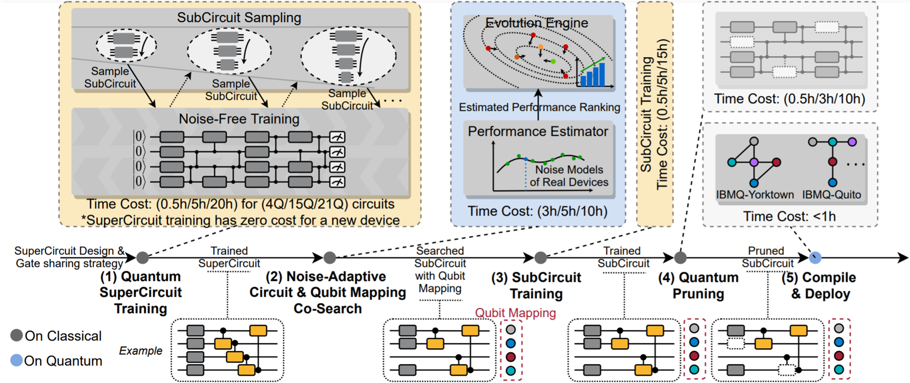

  ### C26. [ELight: Enabling Efficient Photonic In-Memory Neurocomputing with Life Enhancement](https://arxiv.org/abs/2112.08512)
   * accepted \| <a href="/publications/papers/ONN_ASPDAC2022_Gu.pdf" style="color:#3793ae">preprint</a>
   * Hanqing Zhu, **Jiaqi Gu**, Chenghao Feng, Mingjie Liu, Zixuan Jiang, Ray T. Chen, and David  Z. Pan
   * ACM/IEEE Asian and South Pacific Design Automation Conference (ASP-DAC), Jan. 17-20, 2022.  

* 2021
  ### C25. [L2ight: Enabling On-Chip Learning for Optical Neural Networks via Efficient in-situ Subspace Optimization](https://arxiv.org/abs/2110.14807)
   * <a href="/publications/papers/ONN_NeurIPS2021_Gu.pdf" style="color:#3793ae">preprint</a> \| <a href="/publications/papers/ONN_NeurIPS2021_Gu_poster.pdf" style="color:#3793ae">poster</a> \| <a href="/publications/papers/ONN_NeurIPS2021_Gu_slides.pdf" style="color:#3793ae">slides</a> \| [code](https://github.com/JeremieMelo/L2ight)
   * **Jiaqi Gu**, Hanqing Zhu, Chenghao Feng, Zixuan Jiang, Ray T. Chen, and David  Z. Pan
   * Conference on Neural Information Processing Systems (NeurIPS), Dec. 7-10, 2021.  
   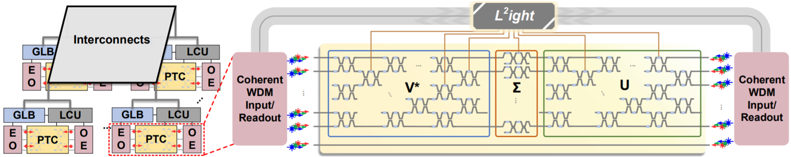

  ### C24. [Towards Memory-Efficient Neural Networks via Multi-Level in situ Generation](https://arxiv.org/abs/2108.11430)
   * <a href="/publications/papers/ML_ICCV2021_Gu.pdf" style="color:#3793ae">preprint</a> \| <a href="/publications/papers/ML_ICCV2021_Gu_poster.pdf" style="color:#3793ae">poster</a> \| <a href="/publications/papers/ML_ICCV2021_Gu_poster.pdf" style="color:#3793ae">slides</a> \| [code](https://github.com/JeremieMelo/Memory-Efficient-Multi-Level-Generation)
   * **Jiaqi Gu**, Hanqing Zhu, Chenghao Feng, Mingjie Liu, Zixuan Jiang, Ray T. Chen, and David  Z. Pan
   * International Conference on Computer Vision (ICCV), Oct. 10-17, 2021.  
   

  ### C23. [A New Acceleration Paradigm for Discrete CosineTransform and Other Fourier-Related Transforms](https://arxiv.org/abs/2110.01172)
   * preprint \| [code](https://github.com/JeremieMelo/dct_cuda)
   * Zixuan Jiang, **Jiaqi Gu**, David Z. Pan
   * arXiv preprint 2110.01172.  

  ### C22. [Optimizer Fusion: Efficient Training with Better Locality and Parallelism](https://arxiv.org/abs/2104.00237)
   * <a href="/publications/papers/ML_ICLRW2021_Gu.pdf" style="color:#3793ae">preprint</a>
   * Zixuan Jiang, **Jiaqi Gu**, Mingjie Liu, Keren Zhu, and David  Z. Pan
   * International Conference on Learning Representations (ICLR) Workshop, Hardware Aware Efficient Training (HAET), May. 07, 2021.  
   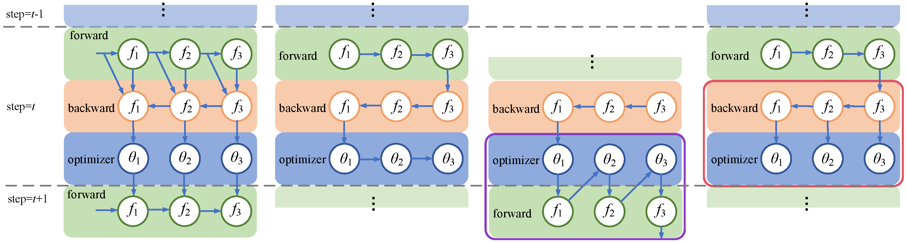

  ### C21. [Experimental Demonstration of a WDM-based Integrated Optical Decoder for Compact Optical Computing](https://doi.org/10.1364/CLEO_SI.2021.SW3C.3)
   * <a href="/publications/papers/ONN_CLEO2021_Gu.pdf" style="color:#3793ae">preprint</a>
   * Chenghao Feng, **Jiaqi Gu**, Hanqing Zhu, David  Z. Pan, and Ray T. Chen
   * Conference on Lasers and Electro-Optics (CLEO), Virtual Conference, May. 11-13, 2021.  

  ### C20. [Integrated  Photonics for Computing, Interconnects and Sensing](https://www.youtube.com/watch?v=HqR3YVC2CUI)
   * *Invited Paper* \| <a href="/publications/papers/ONN_CLEO2021_Gu_Invited.pdf" style="color:#3793ae">preprint</a>
   * Jason Midkiff, Ali Rostamian, Kyoung Min Yoo, Aref Asghari, Chao Wang, Chenghao Feng, Zhoufeng Ying, **Jiaqi Gu**, Haixia Mei, Ching-Wen Chang, James Fang, Alan Huang, Jong-Dug Shin, Xiaochuan Xu, Michael Bukshtab, David  Z. Pan, and Ray T. Chen
   * Conference on Lasers and Electro-Optics (CLEO), Virtual Conference, May. 11-13, 2021.  
   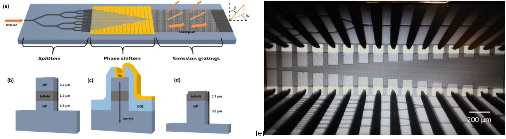

  ### C19. [Efficient On-Chip Learning for Optical Neural Networks Through Power-Aware Sparse Zeroth-Order Optimization](https://arxiv.org/abs/2012.11148)
   * <a href="/publications/papers/ONN_AAAI2021_Gu.pdf" style="color:#3793ae">preprint</a>
   * **Jiaqi Gu**, Chenghao Feng, Zheng Zhao, Zhoufeng Ying, Ray T. Chen and David Z. Pan
   * Association for the Advancement of Artificial Intelligence (AAAI), Virtual Conference, Feb. 02-09, 2021.  
   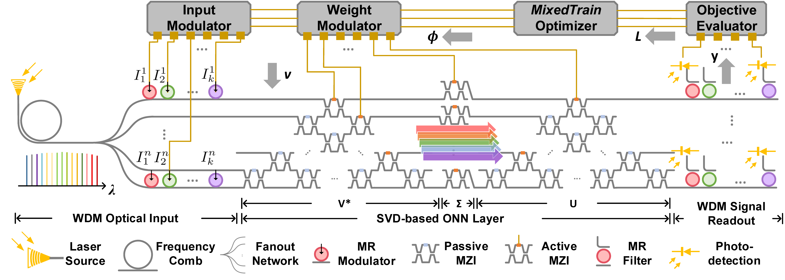

  ### C18. [Logic Synthesis Meets Machine Learning: Trading Exactness for Generalization](https://arxiv.org/pdf/2012.02530)
   * <a href="/publications/papers/IWLS_DATE2021_Gu.pdf" style="color:#3793ae">preprint</a>
   * Shubham Rai, Walter Lau Neto, Yukio Miyasaka, Xinpei Zhang, Mingfei Yu, Qingyang Yi, Masahiro Fujita, Guilherme B. Manske, Matheus F. Pontes, Leomar S. da Rosa Junior, Marilton S. de Aguiar, Paulo F. Butzen, Po-Chun Chien, Yu-Shan Huang, Hoa-Ren Wang, Jie-Hong R. Jiang, **Jiaqi Gu**, Zheng Zhao, Zixuan Jiang, David Z. Pan, Brunno A. de Abreu, Isac de Souza Campos, Augusto Berndt, Cristina Meinhardt, Jonata T. Carvalho, Mateus Grellert, Sergio Bampi, Aditya Lohana, Akash Kumar, Wei Zeng, Azadeh Davoodi, Rasit O. Topaloglu, Yuan Zhou, Jordan Dotzel, Yichi Zhang, Hanyu Wang, Zhiru Zhang, Valerio Tenace, Pierre-Emmanuel Gaillardon, Alan Mishchenko and Satrajit Chatterjee
   * IEEE Design, Automation & Test in Europe Conference & Exhibition (DATE), Virtual Conference, Feb. 01-05, 2021. 
   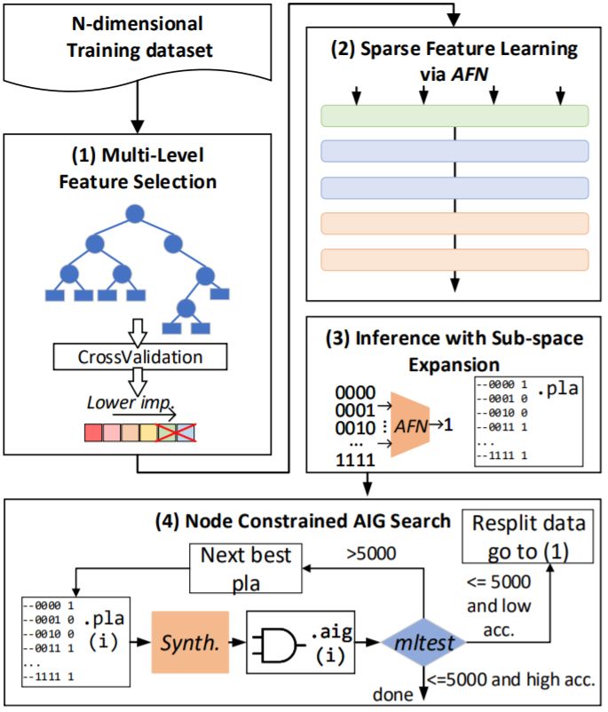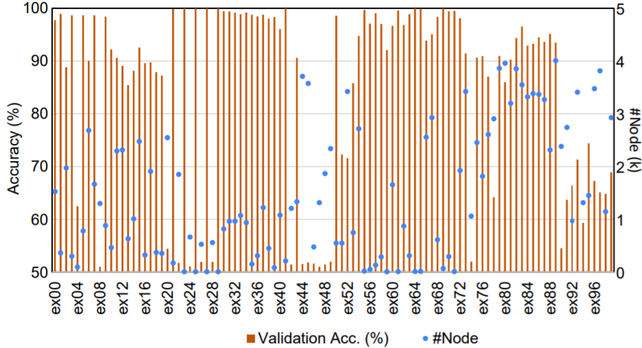

  ### C17. [SqueezeLight: Towards Scalable Optical Neural Networks with Multi-Operand Ring Resonators](https://doi.org/10.23919/DATE51398.2021.9474147)
   * <a href="/publications/papers/ONN_DATE2021_SqueezeLight_Gu.pdf" style="color:#3793ae">preprint</a> \| <a href="/publications/papers/ONN_DATE2021_SqueezeLight_Gu_slides.pdf" style="color:#3793ae">slides</a> \| [code](https://github.com/JeremieMelo/SqueezeLight)
   * **Jiaqi Gu**, Chenghao Feng, Zheng Zhao, Zhoufeng Ying, Mingjie Liu, Ray T. Chen and David Z. Pan
   * IEEE Design, Automation & Test in Europe Conference & Exhibition (DATE), Virtual Conference, Feb. 01-05, 2021. 
   

  ### C16. [O2NN: Optical Neural Networks with Differential Detection-Enabled Optical Operands](https://doi.org/10.23919/DATE51398.2021.9474203)
   * <a href="/publications/papers/ONN_DATE2021_O2NN_Gu.pdf" style="color:#3793ae">preprint</a> \| <a href="/publications/papers/ONN_DATE2021_O2NN_Gu_slides.pdf" style="color:#3793ae">slides</a>
   * **Jiaqi Gu**, Zheng Zhao, Chenghao Feng, Zhoufeng Ying, Ray T. Chen and David Z. Pan
   * IEEE Design, Automation & Test in Europe Conference & Exhibition (DATE), Virtual Conference, Feb. 01-05, 2021. 
  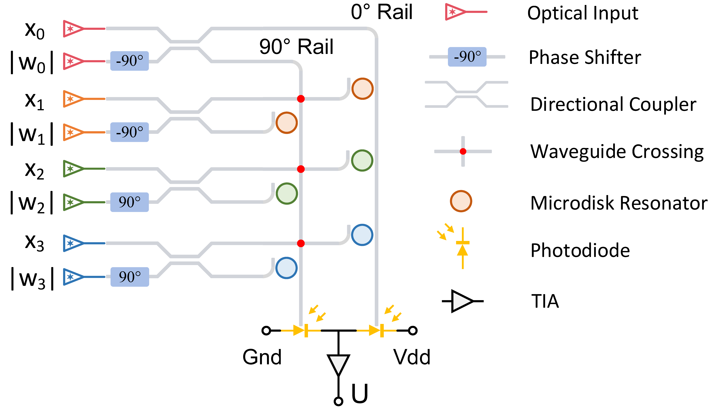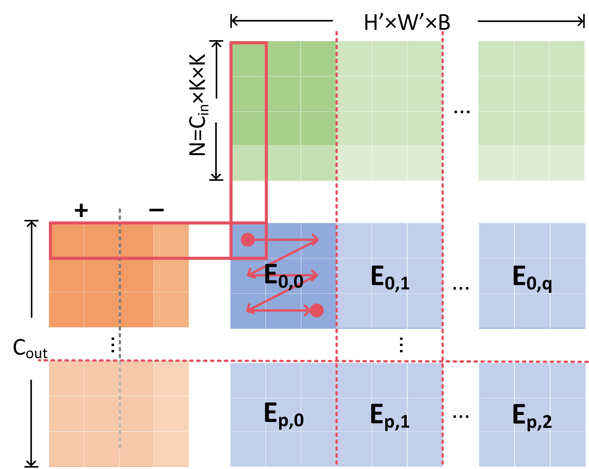

  ### C15. [Scalable fast-Fourier-transform-based (FFT-based) integrated optical neural network for compact and energy-efficient deep learning](https://doi.org/10.1117/12.2578009)
   * accepted
   * Chenghao Feng, **Jiaqi Gu**, Zhoufeng Ying, Zheng Zhao, David Z. Pan and Ray T. Chen
   * SPIE 11690, Smart Photonic and Optoelectronic Integrated Circuits XXIII, 116900I, Mar. 06-11, 2021.

  ### C14. [Wavelength-division-multiplexing-based electronic-photonic integrated circuits for high-performance data processing and transportation](https://doi.org/10.1117/12.2578016)
   * accepted
   * Chenghao Feng, Zhoufeng Ying, Zheng Zhao, **Jiaqi Gu**, David Z. Pan and Ray T. Chen
   * SPIE 11690, Smart Photonic and Optoelectronic Integrated Circuits XXIII, 116900R, Mar. 06-11, 2021.

* 2020
  ### C13. [DREAMPlace 3.0: Multi-Electrostatics Based Robust VLSI Placement with Region Constraints](https://doi.org/10.1145/3400302.3415691)
   * <a href="/publications/papers/PD_ICCAD2020_Gu.pdf" style="color:#3793ae">preprint</a> \| <a href="/publications/papers/PD_ICCAD2020_Gu_slides.pdf" style="color:#3793ae">slides</a>
   * **Jiaqi Gu**, Zixuan Jiang, Yibo Lin and David Z. Pan
   * IEEE/ACM International Conference on Computer-Aided Design (ICCAD), Nov. 02-05, 2020. 
   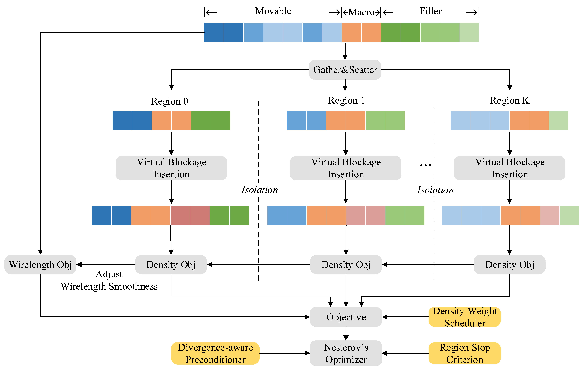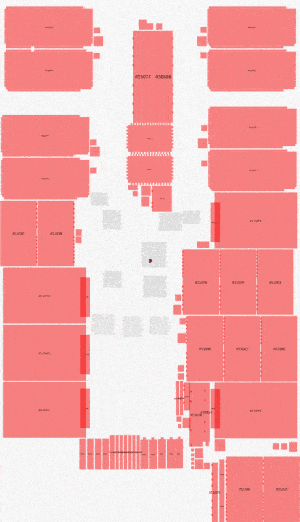

  ### C12. [An Efficient Training Framework for Reversible Neural Architectures](https://doi.org/10.1007/978-3-030-58583-9_17)
   * <a href="/publications/papers/ML_ECCV2020_Gu.pdf" style="color:#3793ae">preprint</a> \| <a href="/publications/papers/ML_ECCV2020_Gu_slides.pdf" style="color:#3793ae">slides</a>
   * Zixuan Jiang, Keren Zhu, Mingjie Liu, **Jiaqi Gu** and David Z. Pan
   * European Conference on Computer Vision (ECCV), Aug. 23-28, 2020. 
   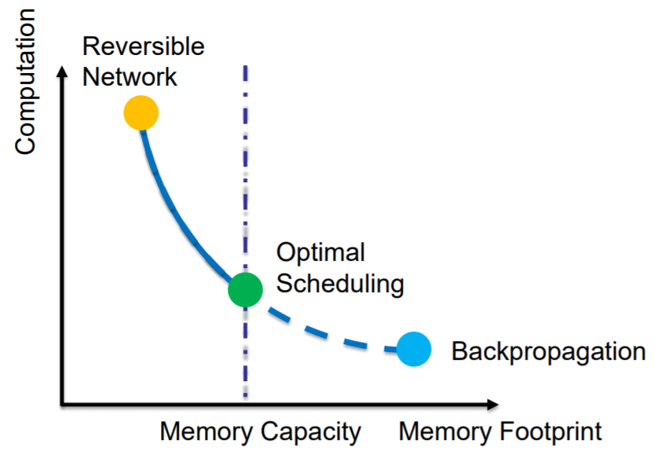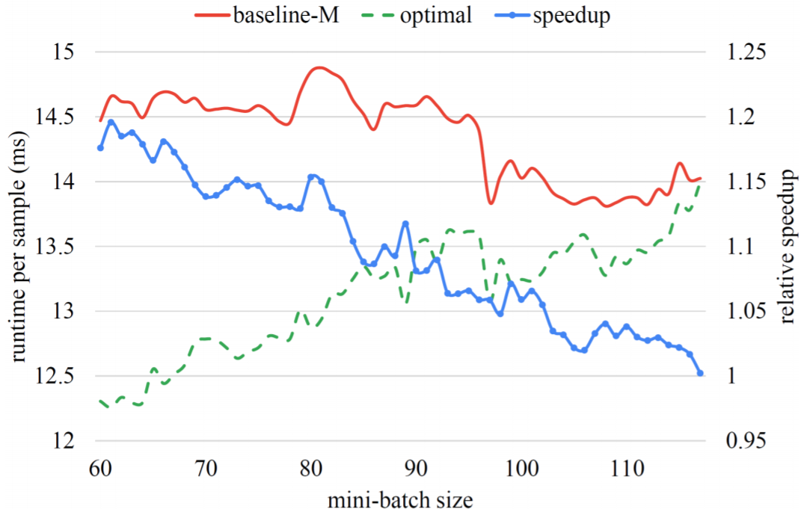

  ### C11. [FLOPS: Efficient On-Chip Learning for Optical Neural Networks Through Stochastic Zeroth-Order Optimization](https://doi.org/10.1109/DAC18072.2020.9218593)
   * <a href="/publications/papers/ONN_DAC2020_Gu.pdf" style="color:#3793ae">preprint</a> \| <a href="/publications/papers/ONN_DAC2020_Gu_poster.pdf" style="color:#3793ae">poster</a>
   * **Jiaqi Gu**, Zheng Zhao, Chenghao Feng, Wuxi Li, Ray T. Chen and David Z. Pan
   * ACM/IEEE Design Automation Conference (DAC), San Francisco, CA, Jul. 19-23, 2020. (**Best Paper Finalist**) 
   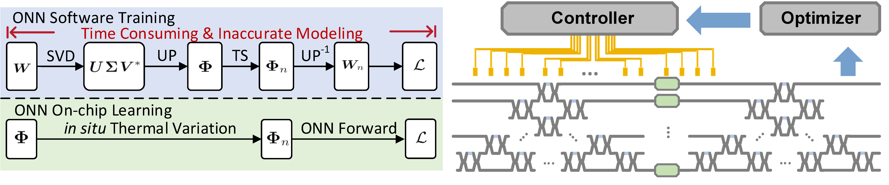

  ### C10. [Massive parallelism Fourier-optic convolutional processor](https://doi.org/10.1364/SPPCOM.2020.SpTh3I.7)
   * <a href="/publications/papers/ONN_SPPCom2020_Gu.pdf" style="color:#3793ae">preprint</a>
   * Mario Miscuglio, Zibo Hu, Shurui Li, **Jiaqi Gu**, Aydin Babakhani, Puneet Gupta, Chee-Wei Wong, David Pan, Seth Bank, Hamed Dalir, and Volker J. Sorger
   * OSA Advanced Photonics Congress (AP) Signal Processing in Photonic Communications (SPPCom), Washington, DC, Jul. 13–16, 2020. 
   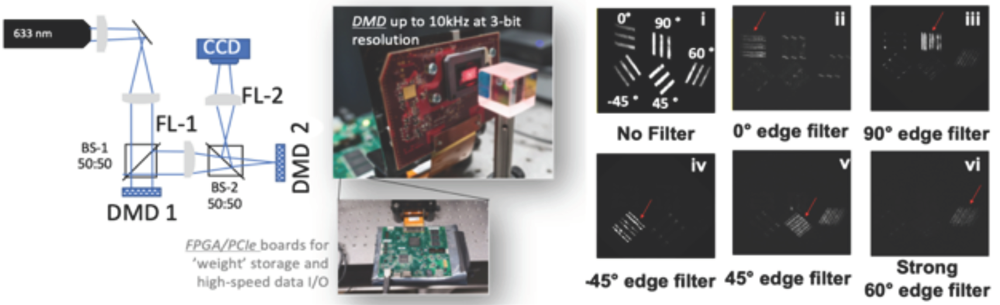

  ### C9. [Million-channel parallelism Fourier-optic convolutional filter and neural network processor](https://doi.org/10.1364/CLEO_AT.2020.JF3A.4)
   * <a href="/publications/papers/ONN_CLEO2020_Gu_FOCNN.pdf" style="color:#3793ae">preprint</a>
   * Mario Miscuglio, Zibo Hu, Shurui Li, **Jiaqi Gu**, Aydin Babakhani, Puneet Gupta, Chee-Wei Wong, David Pan, Seth Bank, Hamed Dalir and Volker J. Sorger
   * CLEO: Science and Innovations, San Jose, CA, May 10-15, 2020. 
   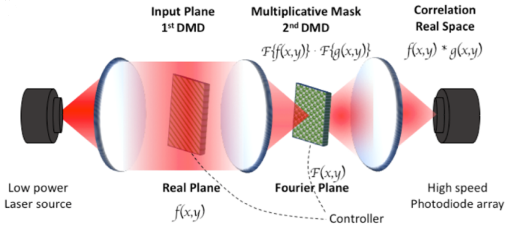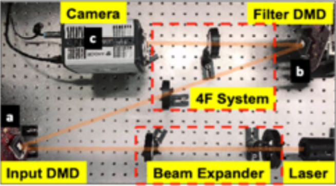

  ### C8. [Integrated WDM-based Optical Comparator for High-speed Computing](https://doi.org/10.1364/CLEO_SI.2020.SM3O.1)
   * <a href="/publications/papers/ONN_CLEO2020_Gu_WDM.pdf" style="color:#3793ae">preprint</a>
   * Chenghao Feng, Zhoufeng Ying, Zheng Zhao, **Jiaqi Gu**, David Z. Pan and Ray T. Chen
   * CLEO: Science and Innovations, San Jose, CA, May 10-15, 2020. 
  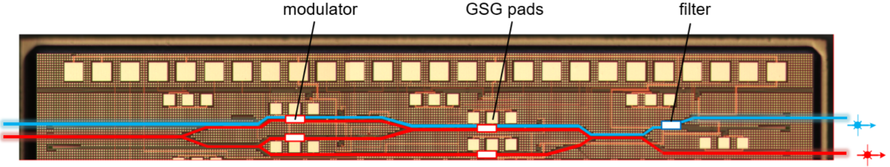

  ### C7. [Compact design of On-chip Elman Optical Recurrent Neural Network](https://doi.org/10.1364/CLEO_AT.2020.JTh2B.8)
   * <a href="/publications/papers/ONN_CLEO2020_Gu_ORNN.pdf" style="color:#3793ae">preprint</a> \| <a href="/publications/papers/ONN_CLEO2020_Gu_ORNN_poster.pdf" style="color:#3793ae">poster</a>
   * Chenghao Feng, Zheng Zhao, Zhoufeng Ying, **Jiaqi Gu**, David Z. Pan and Ray T. Chen
   * CLEO: Applications and Technology, San Jose, CA, May 10-15, 2020. 
   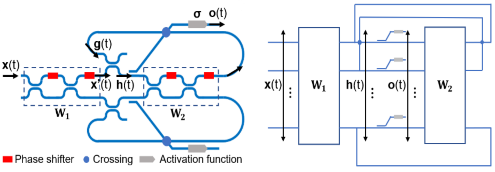

  ### C6. [ROQ: A Noise-Aware Quantization Scheme Towards Robust Optical Neural Networks with Low-bit Controls](https://doi.org/10.23919/DATE48585.2020.9116521)
   * <a href="/publications/papers/ONN_DATE2020_Gu.pdf" style="color:#3793ae">preprint</a> \| <a href="/publications/papers/ONN_DATE2020_Gu_slides.pdf" style="color:#3793ae">slides</a> \| <a href="/publications/papers/ONN_DATE2020_Gu_poster.pdf" style="color:#3793ae">poster</a>
   * **Jiaqi Gu**, Zheng Zhao, Chenghao Feng, Ray T. Chen and David Z. Pan
   * IEEE Design, Automation & Test in Europe Conference & Exhibition (DATE), Grenoble, France, Mar. 09-13, 2020. 
   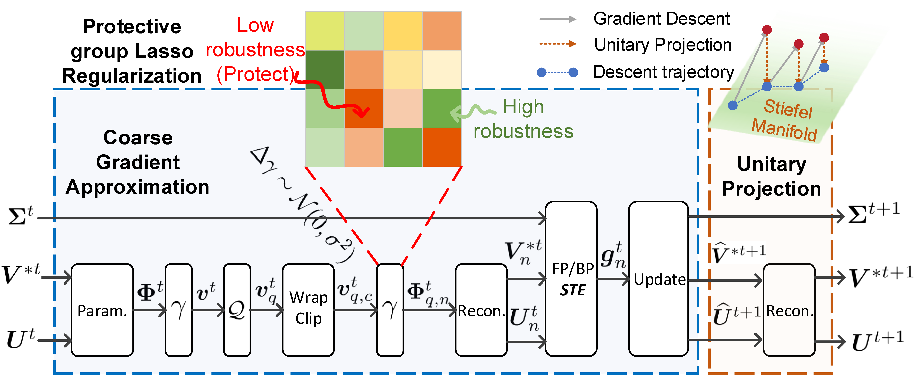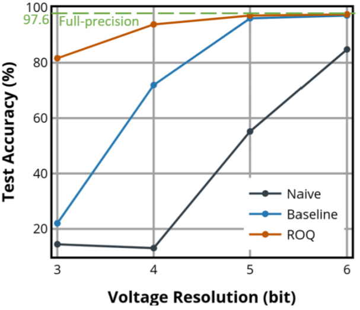

  ### C5. [Towards Decrypting the Art of Analog Layout: Placement Quality Prediction via Transfer Learning](https://doi.org/10.23919/DATE48585.2020.9116330)
   * <a href="/publications/papers/ANALOG_DATE2020_Gu.pdf" style="color:#3793ae">preprint</a>
   * Mingjie Liu, Keren Zhu, **Jiaqi Gu**, Linxiao Shen, Xiyuan Tang, Nan Sun and David Z. Pan
   * IEEE Design, Automation & Test in Europe Conference & Exhibition (DATE), Grenoble, France, Mar. 09-13, 2020. 
   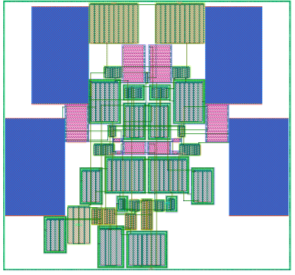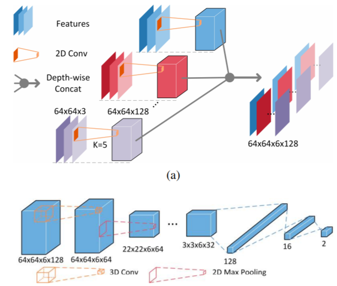

  ### C4. [Wavelength-division-multiplexing based electronic photonic network for high speed computing](https://doi.org/10.1117/12.2551323)
   * <a href="/publications/papers/ONN_PW2020_Gu.pdf" style="color:#3793ae">preprint</a>
   * Chenghao Feng, Zhoufeng Ying, Zheng Zhao, **Jiaqi Gu**, David Z. Pan and Ray T. Chen
   * SPIE Photonics West: Smart Photonic and Optoelectronic Integrated Circuits XXII, San Francisco, California, United States, Feb. 01-06, 2020. 
   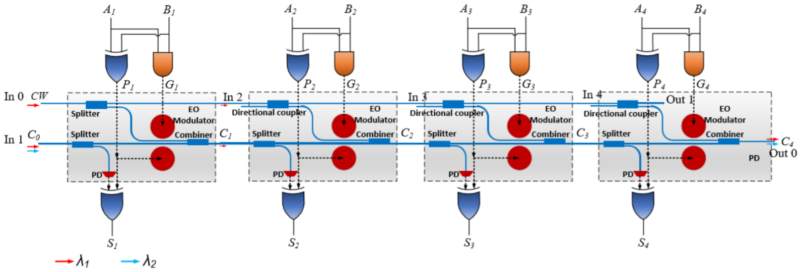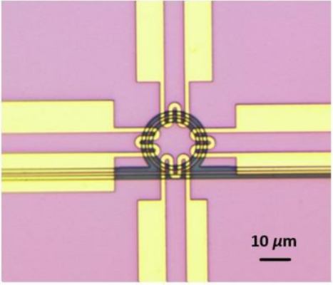

  ### C3. [Towards Area-Efficient Optical Neural Networks: An FFT-based Architecture](https://doi.org/10.1109/ASP-DAC47756.2020.9045156)
   * <a href="/publications/papers/ONN_ASPDAC2020_Gu.pdf" style="color:#3793ae">preprint</a> \| <a href="/publications/papers/ONN_ASPDAC2020_Gu_slides.pdf" style="color:#3793ae">slides</a> \| <a href="/publications/papers/ONN_ASPDAC2020_Gu_poster.pdf" style="color:#3793ae">poster</a>
   * **Jiaqi Gu**, Zheng Zhao, Chenghao Feng, Mingjie Liu, Ray T. Chen and David Z. Pan
   * ACM/IEEE Asian and South Pacific Design Automation Conference (ASP-DAC), Beijing, China, Jan. 13-16, 2020. (**Best Paper Award**) 
   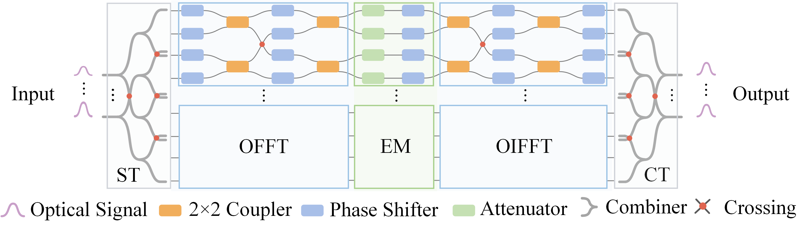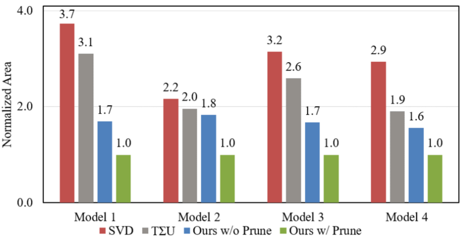

* 2019

  ### C2. [Design Technology for Scalable and Robust Photonic Integrated Circuits](https://doi.org/10.1109/ICCAD45719.2019.8942045)
   * <a href="/publications/papers/ONN_ICCAD2019_Gu.pdf" style="color:#3793ae">preprint</a> \| *Invited Paper*
   * Zheng Zhao, **Jiaqi Gu**, Zhoufeng Ying, Chenghao Feng, Ray T. Chen and David Z. Pan
   * IEEE/ACM International Conference on Computer-Aided Design (ICCAD), Westminster, CO, Nov. 4-7, 2019. 
   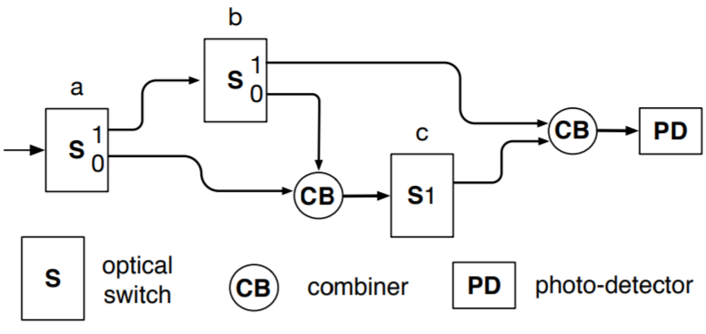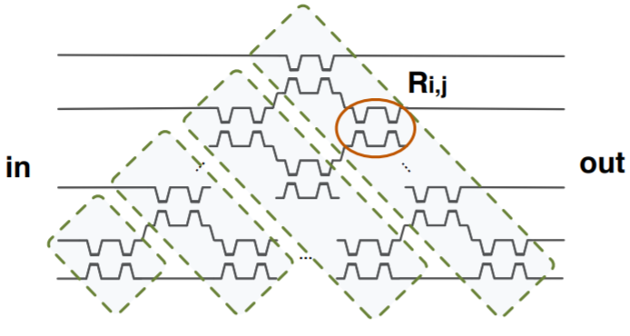

* 2017

  ### C1. [Remote Embedded Simulation System for SW/HW Co-design Based On Dynamic Partial Reconfiguration](https://doi.org/10.1109/ASICON.2017.8252498)
   * <a href="/publications/papers/FPGA_ASICON2017_Gu.pdf" style="color:#3793ae">preprint</a>
   * **Jiaqi Gu**, Ruoyao Wang, Jian Wang, Jinmei Lai and Qinghua Duan
   * IEEE International Conference on ASIC (ASICON), Oct. 25-28, 2017.

Journal Papers
======
* 2021
  ### J10. [Silicon photonic subspace neural chip for hardware-efficient deep learning](https://arxiv.org/abs/2111.06705)
   * preprint
   * Chenghao Feng\*, **Jiaqi Gu**\*, Hanqing Zhu, Zhoufeng Ying, Zheng Zhao, David Z. Pan and Ray T. Chen
   * arXiv preprint 2111.06705.  

  ### J9. [Toward High‐Speed and Energy‐Efficient Computing: A WDM‐Based Scalable On‐Chip Silicon Integrated Optical Comparator](https://doi.org/10.1002/lpor.202000275)
   * <a href="/publications/papers/ONN_LPR2021_Gu.pdf" style="color:#3793ae">preprint</a>
   * Chenghao Feng, Zhoufeng Ying, Zheng Zhao, **Jiaqi Gu**, David Z. Pan and Ray T. Chen
   * Laser & Photonics Reviews, May., 2021. 
   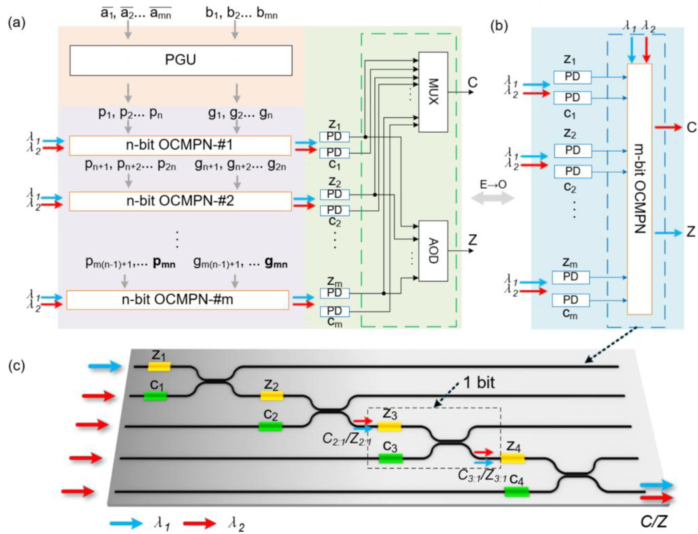

* 2020
  ### J8. [Sequential logic and pipelining in chip-based electronic-photonic digital computing](https://doi.org/10.1109/JPHOT.2020.3031641)
   * <a href="/publications/papers/ONN_IEEEPJ2020_Gu.pdf" style="color:#3793ae">preprint</a>
   * Zhoufeng Ying, Chenghao Feng, Zheng Zhao, **Jiaqi Gu**, Richard Soref, David Z. Pan and Ray T. Chen
   * IEEE Photonics Journal, Oct., 2020. 
   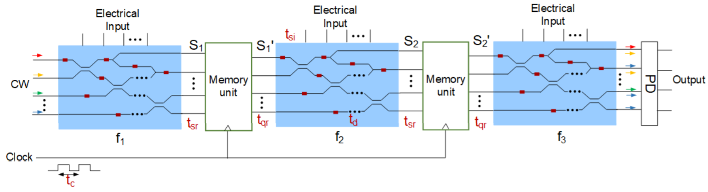

  ### J7. [Towards Hardware-Efficient Optical Neural Networks: Beyond FFT Architecture via Joint Learnability](https://doi.org/10.1109/TCAD.2020.3027649)
   * <a href="/publications/papers/ONN_TCAD2020_Gu.pdf" style="color:#3793ae">preprint</a>
   * **Jiaqi Gu**, Zheng Zhao, Chenghao Feng, Zhoufeng Ying, Mingjie Liu, Ray T. Chen and David Z. Pan
   * IEEE Transaction on Computer-Aided Design of Integrated Circuits and Systems (TCAD), Sept., 2020. 
   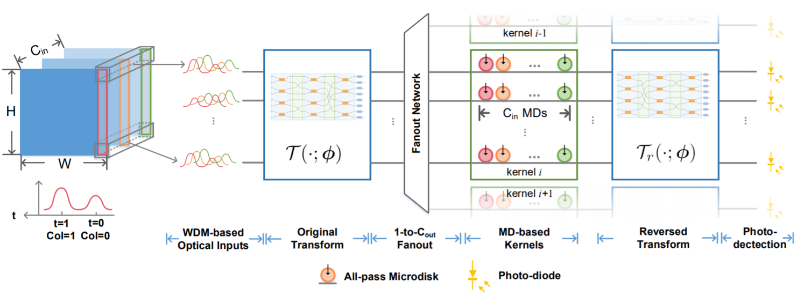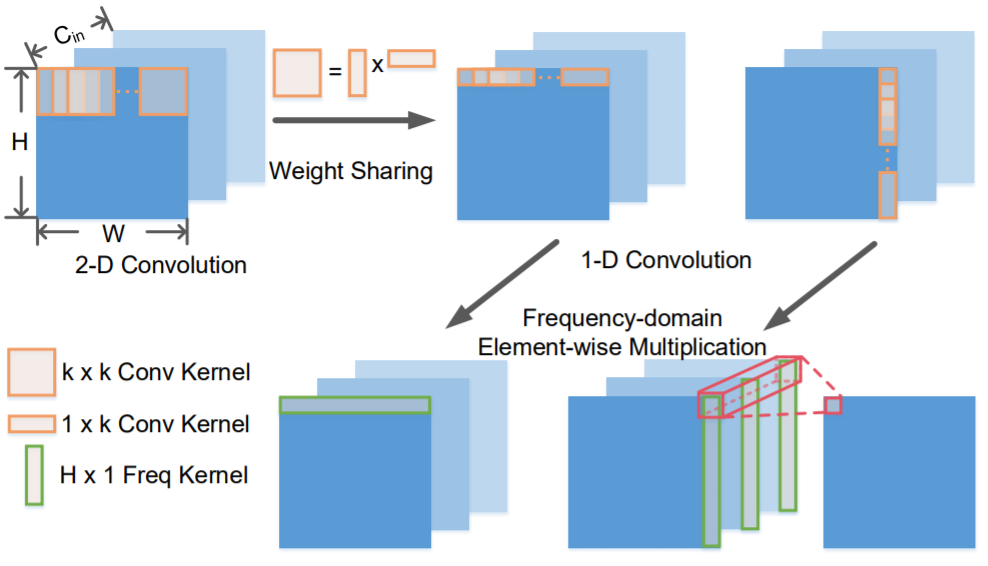

  ### J6. [Wavelength-division-multiplexing (WDM)-based integrated electronic–photonic switching network (EPSN) for high-speed data processing and transportation](https://doi.org/10.1515/nanoph-2020-0356)
   * <a href="/publications/papers/ONN_Nanophotonics2020_Gu.pdf" style="color:#3793ae">preprint</a>
   * Chenghao Feng, Zhoufeng Ying, Zheng Zhao, **Jiaqi Gu**, David Z. Pan and Ray T. Chen
   * Nanophotonics, Sept., 2020. 
   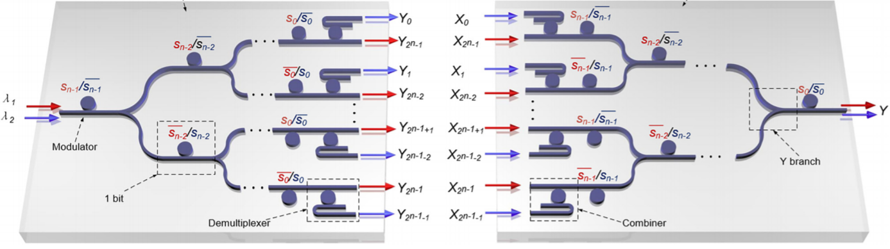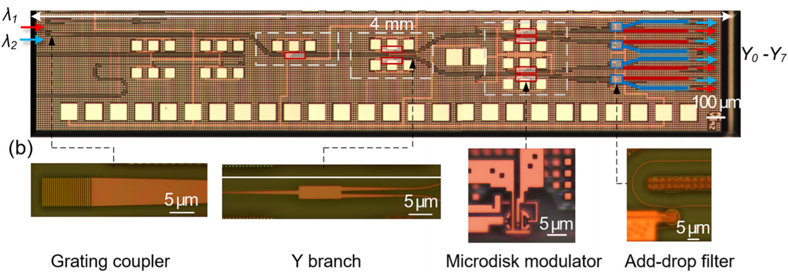

  ### J5. [DREAMPlace: Deep Learning Toolkit-Enabled GPU Acceleration for Modern VLSI Placement](https://doi.org/10.1109/TCAD.2020.3003843)
   * <a href="/publications/papers/PD_TCAD2020_DREAMPlace_Gu.pdf" style="color:#3793ae">preprint</a>
   * Yibo Lin, Zixuan Jiang, **Jiaqi Gu**, Wuxi Li, Shounak Dhar, Haoxing Ren, Brucek Khailany and David Z. Pan
   * IEEE Transaction on Computer-Aided Design of Integrated Circuits and Systems (TCAD), Jun., 2020. (**Best Paper Award**) 
   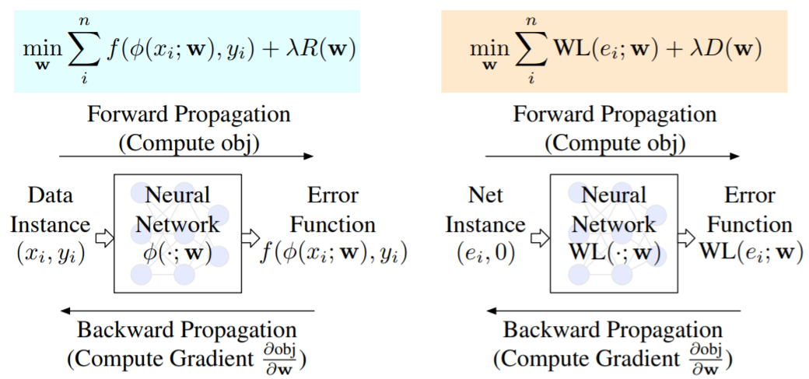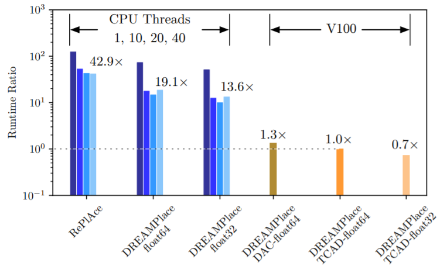

  ### J4. [Electronic-photonic Arithmetic Logic Unit for High-speed Computing](https://doi.org/10.1038/s41467-020-16057-3)
   * <a href="/publications/papers/ONN_NatureComm2020_Gu.pdf" style="color:#3793ae">preprint</a>
   *  Zhoufeng Ying, Chenghao Feng, Zheng Zhao, Shounak Dhar, Hamed Dalir, **Jiaqi Gu**, Yue Cheng, Richard Soref, David Pan, and Ray Chen
   * Nature Communications, Apr., 2020. 
   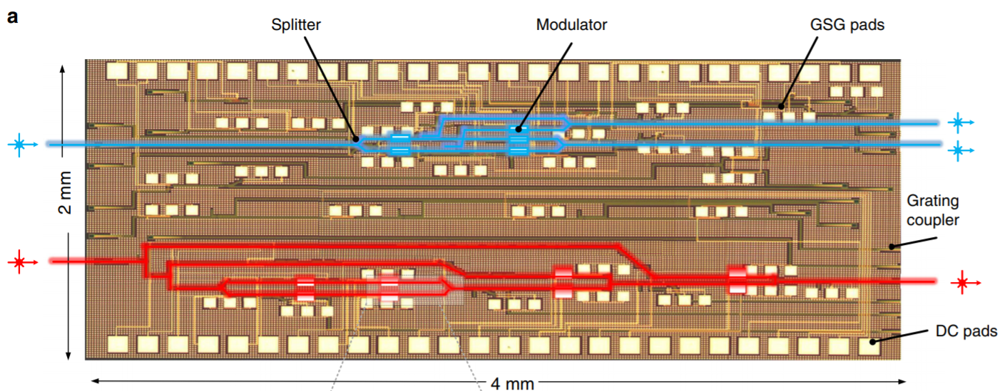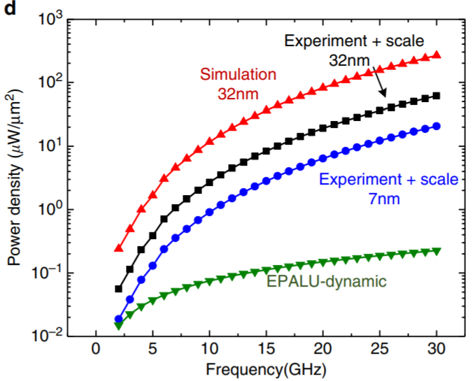

  ### J3. [ABCDPlace: Accelerated Batch-based Concurrent Detailed Placement on Multi-threaded CPUs and GPUs](https://doi.org/10.1109/TCAD.2020.2971531)
   * <a href="/publications/papers/PD_TCAD2020_Gu.pdf" style="color:#3793ae">preprint</a>
   * Yibo Lin, Wuxi Li, **Jiaqi Gu**, Mark Ren, Brucek Khailany and David Z. Pan
   * IEEE Transaction on Computer-Aided Design of Integrated Circuits and Systems (TCAD), Feb., 2020. 
   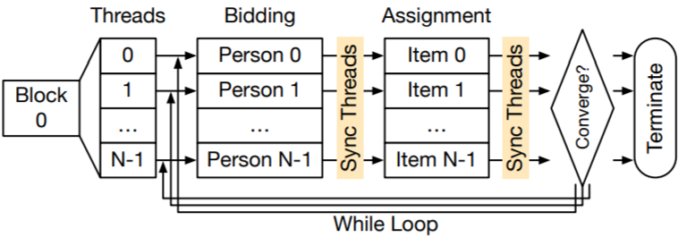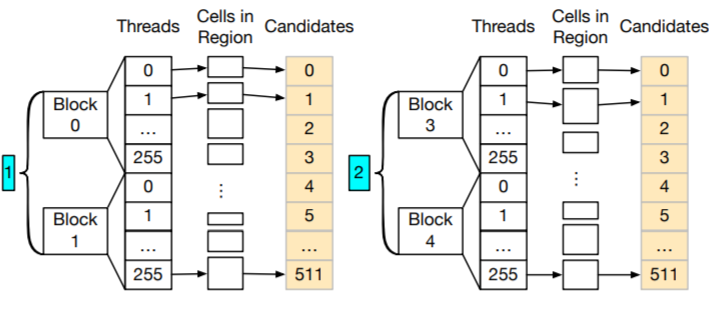

* 2019
  ### J2. [High-resolution Image Reconstruction for Portable Ultrasound Imaging Devices](https://doi.org/10.1186/s13634-019-0649-x)
   * <a href="/publications/papers/ML_EURASIP2019_Gu.pdf" style="color:#3793ae">preprint</a>
   * Ruoyao Wang, Zhenghan Fang, **Jiaqi Gu**, Yi Guo, Shicong Zhou, Yuanyuan Wang, Cai Chang and Jinhua Yu
   * EURASIP Journal on Advances in Signal Processing, Dec., 2019. 
   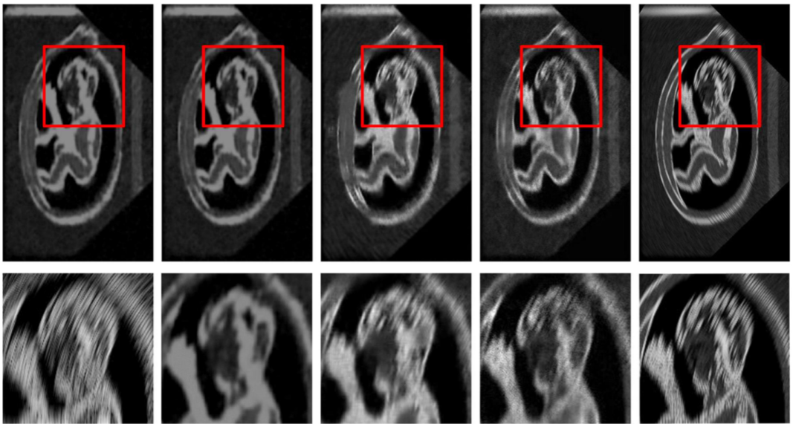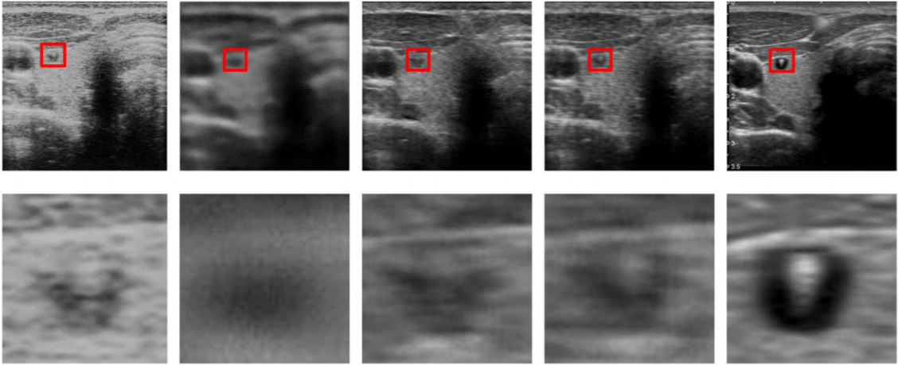

  ### J1. [Deep Generative Adversarial Networks for Thin-section Infant MR Image Reconstruction](https://doi.org/10.1109/ACCESS.2019.2918926)
   * <a href="/publications/papers/ML_IEEEACCESS2019_Gu.pdf" style="color:#3793ae">preprint</a>
   * **Jiaqi Gu**, Zeju Li, Yuanyuan Wang, Haowei Yang, Zhongwei Qiao and Jinhua Yu
   * IEEE Access, May, 2019. 
   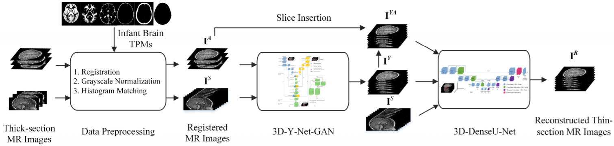
